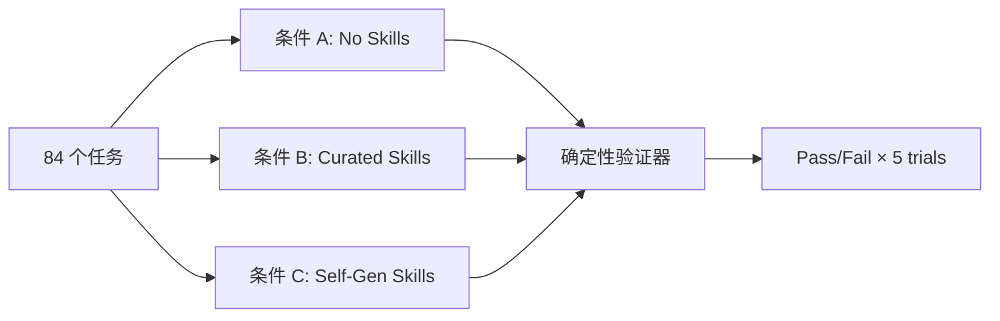

# SkillsBench 深度解读：7308 条轨迹告诉你，Agent Skills 到底有多大用

> 论文：[SkillsBench: Benchmarking How Well Agent Skills Work Across Diverse Tasks](https://arxiv.org/abs/2602.12670)
>
> 作者：Wenbo Chen, Yimin Liu 等 38 人
>
> **第一篇系统量化 Agent Skills 效果的 Benchmark 论文。核心结论：人工写的 Skills 平均提升 16.2pp，但模型自己写的 Skills 反而降 1.3pp——有效的过程性知识不能靠 AI 自动生成。**

---

## 一、这篇论文在解决什么问题

### 1.1 背景

LLM 已经从文本生成器进化成了能执行复杂多步任务的自主 Agent。Claude Code、Codex CLI、Gemini CLI 这些工具让开发者可以直接在终端里把前沿模型当 Agent 用。

但有一个根本矛盾：**基础模型提供广泛能力，却缺少特定领域的操作流程知识**。微调太贵又损失通用性。

**Agent Skills** 是一种新兴的解决方案——在推理时注入结构化的过程性知识包，不修改模型参数就能增强领域能力。一个 Skill 包含：

- **SKILL.md**：操作指南（标准流程、领域约定、经验法则）
- **Resources**：脚本、代码模板、示例文件

Skills 生态已经爆发式增长，社区仓库有成千上万用户贡献的 Skills。但关键问题是：**没人系统量化过 Skills 到底有没有用、什么样的 Skills 最有效。**

### 1.2 核心问题

论文要回答四个问题：

1. Skills 能提升多少性能？在不同模型/harness 上是否一致？
2. 不同领域的 Skills 效果差异有多大？
3. 模型能不能自己生成有效的 Skills？
4. Skills 的数量和复杂度怎么影响效果？

### 1.3 Skills 与其他增强方式的区别

这个定义很重要，因为很容易和其他东西混淆：

| 增强方式 | 内容类型 | 结构化 | 可执行资源 | 跨模型可移植 |
|---------|---------|--------|-----------|------------|
| **Agent Skills** | 过程性（怎么做） | ✅ SKILL.md + 资源文件 | ✅ 脚本/模板 | ✅ |
| System Prompt | 声明性 | ❌ 纯文本 | ❌ | ✅ |
| Few-shot 示例 | 声明性（输入→输出） | ❌ | ❌ | ✅ |
| RAG 检索 | 事实性（是什么） | ⚠️ 部分 | ❌ | ✅ |
| 工具文档 | 描述性（能做什么） | ⚠️ 部分 | ❌ | ✅ |
| 微调 | 参数修改 | N/A | N/A | ❌ |

Skills 的独特之处：**编码过程性知识（procedural knowledge）**，且以文件系统为基础，易于编辑、版本管理、跨 harness 共享。

---

## 二、方法：怎么评估的

### 2.1 核心 Insight

论文的核心方法论创新是 **Paired Evaluation（配对评估）**——同一个任务、同一个模型，分别在"无 Skills"、"有人工 Skills"、"有自生成 Skills"三种条件下运行，直接对比效果差异。



这避免了"不同 benchmark 用不同任务导致不可比"的经典问题。

### 2.2 Benchmark 构建流程

整个流程分三阶段：

**阶段 1 — 数据收集**：
- 从开源仓库（12,847 个）、Claude Code 生态（28,412 个）、企业合作伙伴（5,891 个）收集了 **47,150 个 Skills**
- 105 位贡献者提交了 322 个候选任务

**阶段 2 — 质量过滤**（这部分做得非常扎实）：

自动化检查：
- 结构验证：必需文件是否齐全、目录结构是否正确
- Oracle 执行：参考解必须 100% 通过测试
- AI 检测：指令必须是人写的（GPTZero 检测 + 人工审核，100% 达到人类标签）
- **泄露审计**：CI 自动检测 Skill 是否包含任务特定的答案

人工审核（五项标准）：
1. 数据有效性（输入必须反映真实复杂度）
2. 任务真实性（必须是实际工作流）
3. 参考答案质量
4. Skills 质量（无错误、内部一致、对同类任务通用有效）
5. 反作弊（防止走捷径——改输入数据、从测试文件抽答案、利用验证器实现漏洞）

**阶段 3 — 评估**：7 种模型-harness 配置 × 3 种条件 × 84 任务 × 5 次重复 = **7,308 条有效轨迹**

### 2.3 评估指标

**Pass Rate**：每个任务 5 次取平均，再对 84 个任务取平均。

**Normalized Gain（归一化增益）**：借鉴物理教育研究的 Hake 公式：

$$g = \frac{\text{pass}_{\text{skill}} - \text{pass}_{\text{vanilla}}}{1 - \text{pass}_{\text{vanilla}}}$$

含义：在"可提升空间"中实际提升了多少比例。90%→95% 和 10%→55% 的 $g$ 都是 0.5。

论文同时报告绝对提升 $\Delta$ 和归一化增益 $g$，避免单一指标的误导。

### 2.4 测试的模型和 Harness

| Harness | 模型 | 备注 |
|---------|------|------|
| Claude Code | Opus 4.5, Opus 4.6, Sonnet 4.5, Haiku 4.5 | 原生 Skills 集成 |
| Gemini CLI | Gemini 3 Pro, Gemini 3 Flash | 不支持 self-gen 条件 |
| Codex CLI | GPT-5.2 | — |

全部使用 temperature=0 确保确定性采样。

---

## 三、实验结果

### 3.1 主要结果：Skills 平均提升 16.2pp

| 配置 | 无 Skills | 有 Skills | 提升 Δ | 归一化增益 g |
|------|-----------|-----------|--------|-------------|
| Claude Code + Opus 4.5 | 22.0% | 45.3% | **+23.3pp** | 0.30 |
| Claude Code + Opus 4.6 | 32.6% | 46.5% | +13.9pp | 0.21 |
| Claude Code + Sonnet 4.5 | 20.2% | 36.4% | +16.2pp | 0.20 |
| Claude Code + Haiku 4.5 | 11.0% | 27.7% | +16.7pp | 0.19 |
| Gemini CLI + Flash | 31.3% | 48.7% | +17.4pp | 0.25 |
| Gemini CLI + Pro | 30.0% | 43.6% | +13.6pp | 0.19 |
| Codex + GPT-5.2 | 29.3% | 44.7% | +15.4pp | 0.22 |
| **平均** | | | **+16.2pp** | **0.22** |

**关键解读**：
- **+16.2pp 是非常显著的提升**。如果原来 100 个任务做对 25 个，加了 Skills 能做对 41 个——提升超过 60%
- **Opus 4.5 提升最大**（+23.3pp），因为 Claude Code 对 Skills 规范有原生集成
- **Gemini 3 Flash 绝对性能最高**（48.7%），但它靠的是消耗更多 token（比 Pro 多 2.3 倍输入 token）来弥补推理深度

### 3.2 核心发现：自生成 Skills 彻底失败

| 配置 | 自生成 Skills 效果 |
|------|------------------|
| Opus 4.6 | +1.4pp（唯一正数）|
| Opus 4.5 | -0.1pp |
| Sonnet 4.5 | -1.4pp |
| Haiku 4.5 | -0.7pp |
| Codex + GPT-5.2 | **-5.6pp**（严重退化）|
| **平均** | **-1.3pp** |

人工 Skills **+16.2pp** vs 自生成 Skills **-1.3pp**——差距接近 **18 个百分点**。

**模型不能可靠地自己写出它们能从中受益的过程性知识。**

轨迹分析揭示两种失败模式：
1. **知道需要但写不好**：模型识别出需要领域知识，但生成的流程不精确（如只写"用 pandas 处理数据"而没有具体 API 模式）
2. **根本没意识到需要**：对高领域知识任务（制造业、金融），模型试图用通用方法蛮力解决，完全没生成领域特定的 Skills

### 3.3 领域差异：最高差 12 倍

| 领域 | 提升 Δ | 解读 |
|------|--------|------|
| Healthcare（医疗） | **+51.9pp** | 临床数据协调、医疗流程——预训练覆盖极少 |
| Manufacturing（制造业） | **+41.9pp** | 制造工艺流程——模型几乎不懂 |
| Data Analysis（数据分析） | +17.8pp | 特定数据处理模式 |
| Finance（金融） | +15.0pp | 合规流程、报表格式 |
| Cybersecurity（网络安全） | +12.9pp | 安全审计流程 |
| Science（科学） | +11.4pp | 专业计算流程 |
| Mathematics（数学） | +6.0pp | 模型本身就有较强数学能力 |
| Software Engineering（软件） | **+4.5pp** | 模型最强的领域，Skills 帮助有限 |

**清晰规律**：**模型预训练数据覆盖越少的领域，Skills 价值越高。** 医疗流程这种"模型完全不会"的领域，Skills 几乎是质变；代码这种"模型本来就擅长"的领域，Skills 只是锦上添花。

### 3.4 任务级分析：16/84 个任务中 Skills 有害

**Skills 最有效的任务**（模型从"完全不会"到"基本能做"）：

| 任务 | 提升 | 说明 |
|------|------|------|
| mario-coin-counting | **+85.7pp**（2.9%→88.6%） | 特定游戏分析流程 |
| sales-pivot-analysis | **+85.7pp** | 销售数据透视分析 |
| flood-risk-analysis | **+77.1pp** | 洪水风险评估流程 |
| sec-financial-report | **+74.3pp** | SEC 财务报表处理 |

**Skills 有害的任务**（模型本来能做，加了 Skills 反而做不好）：

| 任务 | 退化 | 可能原因 |
|------|------|---------|
| taxonomy-tree-merge | **-39.3pp** | Skills 引入了冲突的合并策略 |
| energy-ac-optimal-power-flow | -14.3pp | 过于复杂的流程指导干扰了模型的直觉 |
| trend-anomaly-causal-inference | -12.9pp | Skills 与模型已有知识矛盾 |
| exoplanet-detection-period | -11.4pp | 不必要的额外步骤增加了出错概率 |

### 3.5 Skills 设计因素

#### 数量：2-3 个最优

| Skills 数量 | 无 Skills | 有 Skills | 提升 Δ |
|-------------|-----------|-----------|--------|
| 1 个 | 24.3% | 39.1% | +14.8pp |
| **2-3 个** | **22.1%** | **40.7%** | **+18.6pp** |
| 4+ 个 | 28.9% | 34.8% | +5.9pp |

**少即是多。** 4 个以上的 Skills 效果反而下降——可能产生信息过载或指导冲突。

#### 复杂度：精炼 > 全面

| 复杂度 | 无 Skills | 有 Skills | 提升 Δ |
|--------|-----------|-----------|--------|
| **Detailed（详细但聚焦）** | 23.8% | **42.6%** | **+18.8pp** |
| Compact（紧凑简洁） | 22.4% | 39.5% | +17.1pp |
| Comprehensive（全面冗长） | 28.7% | 25.8% | **-2.9pp** |

**全面的参考文档反而有害！** 精炼的步骤指南比面面俱到的手册有效得多。Agent 不擅长从冗长文档中提取关键信息，过长的 Skills 还会挤占上下文预算。

#### 模型规模：小模型 + Skills ≈ 大模型裸跑

```
Claude Haiku 4.5 + Skills:  27.7%
Claude Opus 4.5 无 Skills:  22.0%

→ 小模型配好 Skills 比大模型裸跑还强 5.7pp！
```

这对成本优化有直接指导意义——**与其升级到更贵的模型，不如先写好 Skills**。

### 3.6 Harness 差异

**Claude Code**：Skills 利用率最高。+13.9pp 到 +23.3pp。原生 Skills 集成专门优化了发现和应用流程。

**Gemini CLI**：裸性能最强（Flash 48.7%）。Flash 的策略是用更多 token（比 Pro 多 2.3 倍）弥补推理深度，但由于单价低 4 倍，实际每任务成本反而便宜 44%（$0.55 vs $0.98）。

**Codex CLI**：经常**确认了 Skills 内容却不使用它**——看了但没用。说明 harness 的 Skills 集成质量直接影响效果。

---

## 四、复现与落地评估

### 4.1 复现难度评估

| 维度 | 评级 | 说明 |
|------|------|------|
| 代码开源 | ⚠️ | 论文基于 Harbor 框架，框架开源但 SkillsBench 完整数据集公开程度待确认 |
| 数据可得性 | ⚠️ | 84 个任务的容器化环境需要构建；47K Skills 数据集可能部分公开 |
| 算力需求 | 高 | 7,308 条轨迹 × 商业 API 调用，评估成本不低 |
| 依赖复杂度 | 中 | Docker 容器化，每个任务独立环境 |
| 复现总评 | ⭐⭐⭐ | 方法论可复现，但完整复现需要商业 API 预算和 Harbor 环境 |

### 4.2 工业落地可行性

- **适用场景**：任何使用 Agent Skills 的团队都应参考其结论来指导 Skills 编写策略
- **直接可用的结论**：
  - 2-3 个聚焦 Skills > 堆一大堆文档
  - 先用小模型 + Skills 试水，再决定是否升级模型
  - 不要指望 AI 自动生成 Skills
- **集成难度**：论文本身不是一个产品/工具，而是评估方法论 + 最佳实践指南
- **风险点**：结论基于 2026 年初的模型能力，未来模型的自生成 Skills 能力可能改善
- **落地总评**：⭐⭐⭐⭐⭐（结论直接可用，不需要部署任何东西）

---

## 五、SOTA 对照矩阵

SkillsBench 是第一个 Skills 评估 Benchmark，没有直接对标的前作。但可以和相关 Benchmark 对比定位：

| Benchmark | 评估对象 | 是否评估增强效果 | 领域覆盖 | 确定性验证 |
|-----------|---------|----------------|---------|-----------|
| **SkillsBench** | **Skills 增强效果** | **✅ 三条件配对** | **11 个领域** | **✅ pytest** |
| Terminal-Bench | 模型/harness 裸能力 | ❌ 只评估基线 | 终端任务 | ✅ |
| SWE-bench | 代码修复能力 | ❌ | 软件工程 | ✅ |
| AgentBench | 通用 agent 能力 | ❌ | 8 个环境 | 部分 |
| MLE-bench | ML 工程能力 | ❌ | ML 竞赛 | ✅ |

**SkillsBench 的独特价值**：不是问"模型有多强"，而是问"Skills 能帮模型提升多少"——这是一个全新的评估维度。

---

## 六、讨论与局限

### 6.1 论文自身讨论的局限

1. **只覆盖终端任务**：不包含 GUI agent、多 agent 协作、超长时间跨度工作流
2. **上下文长度干扰**：Skills 注入增加了上下文长度，部分收益可能来自"更多上下文"而非"过程性结构"（但自生成 Skills 的失败部分回应了这个质疑——结构确实重要）
3. **商业 harness 行为可变**：harness 的 Skills 集成可能随版本更新而变化
4. **没测 Skills 组合效应**：多个 Skills 是互补还是冲突，缺乏系统研究

### 6.2 我的额外观察

**实验设计上**：
- 自生成 Skills 条件的失败可能部分源于 prompt 设计——论文没有展示具体的 self-gen prompt，不清楚是否做了充分的 prompt engineering
- 84 个任务的样本量在某些领域（如 Healthcare）可能偏小，单个异常任务就会显著影响领域平均值

**结论推广上**：
- "自生成 Skills 无效"这个结论可能随模型能力提升而改变——当前模型写不好 Skills 不代表未来模型也写不好
- 论文没有测试"人机协作写 Skills"的场景——AI 生成初稿 + 人工修改，可能是更实际的工作流

**缺失的分析**：
- 没有按任务难度交叉分析 Skills 效果——Skills 是对简单任务帮助大还是对困难任务帮助大？
- 没有分析 Skills 的"保质期"——随着模型迭代，同一套 Skills 的效果是否会衰减？

---

## 七、对我们的启示

### 7.1 谁应该关注

- ✅ **所有使用 Claude Code / Codex / Gemini CLI 的开发者**——直接指导你怎么写 Skills
- ✅ **Skills 生态的贡献者/维护者**——知道什么样的 Skills 有效
- ✅ **Agent 框架的开发者**——harness 的 Skills 集成质量至关重要
- ⚠️ 纯研究者——方法论可参考，但结论偏应用

### 7.2 核心 Takeaway

1. **人工写的 Skills 值得投入**：平均 +16.2pp，医疗等专业领域高达 +51.9pp
2. **不要指望 AI 自动生成 Skills**：当前模型完全做不到（-1.3pp）
3. **少即是多**：2-3 个精炼 Skills > 堆一堆文档；详细步骤 > 全面手册
4. **优先在专业领域写 Skills**：模型越不擅长的领域，Skills 价值越高
5. **先写 Skills，再升级模型**：Haiku + Skills > Opus 裸跑，省钱又有效

### 7.3 实践建议

**写 Skills 时**：
- 聚焦具体步骤，不要写成参考手册
- 每个 Skill 解决一个具体子问题
- 包含至少一个可运行的示例
- 面向一类任务，不是单个实例
- 总量控制在 2-3 个模块

**选择模型时**：
- 先用便宜模型 + 好 Skills 建立 baseline
- 只有当 Skills 优化到位后仍不满足需求，才考虑升级模型
- 注意 harness 的 Skills 集成质量——同一个模型在不同 harness 下效果可能差很多

**什么领域优先写 Skills**：
- 🔴 高优先：医疗、制造、金融合规等专业流程
- 🟡 中优先：数据分析、网络安全、科学计算
- 🟢 低优先：通用编程、数学（模型本身已经很强）

---

## 论文速查卡

| 项目 | 内容 |
|------|------|
| **标题** | SkillsBench: Benchmarking How Well Agent Skills Work Across Diverse Tasks |
| **作者** | Wenbo Chen, Yimin Liu 等 38 人 |
| **链接** | [arXiv:2602.12670](https://arxiv.org/abs/2602.12670) |
| **发表** | 预印本 (2026.02) |
| **一句话总结** | 第一个系统量化 Agent Skills 效果的 Benchmark：人工 Skills +16.2pp，自生成 Skills -1.3pp，2-3 个精炼 Skills 效果最佳 |
| **大白话版** | 给 AI 助手一本"操作手册"能让它做事准确很多，但让 AI 自己写这本手册完全不行——还是得人来写 |
| **核心数字** | 人工 Skills +16.2pp，自生成 -1.3pp，医疗领域 +51.9pp，2-3 个 Skills 最优 +18.6pp |
| **复现评级** | ⭐⭐⭐ |
| **落地评级** | ⭐⭐⭐⭐⭐ |
