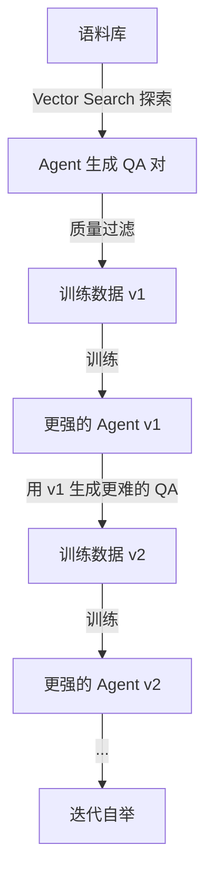

# KARL：用多任务 RL 训练企业搜索 Agent，成本优于 Claude 4.6

> 论文：[Knowledge Agents via Reinforcement Learning](https://arxiv.org/abs/2603.05218)
>
> 作者：Jonathan D. Chang, Andrew Drozdov, Shubham Toshniwal 等 26 人（Databricks）
>
> 通过合成数据 + 多任务 off-policy RL 训练的企业搜索 Agent，在成本-质量和延迟-质量 trade-off 上 Pareto 优于 Claude 4.6 和 GPT 5.2——包括训练时没见过的任务。

---

## 一、这篇论文在解决什么问题

### 1.1 背景

知识 Agent（能迭代查询、检索、推理的系统）是当前最有经济价值的 AI 应用之一——金融、法律、医疗、制造等行业都依赖大量私有数据做"基于证据的推理"（grounded reasoning）。

但现有方案有两个根本问题：
1. **评估碎片化**：HotpotQA 只测多跳 QA、BrowseComp 只测约束搜索、FinanceBench 只测数字推理——没有统一基准衡量"综合搜索能力"
2. **单任务训练不泛化**：在约束搜索上训练的 Agent 不会做报告综合，在数字推理上训练的不会做穷尽检索

### 1.2 核心问题

能否通过异构任务的多任务 RL 训练，让搜索 Agent 在未见过的任务类型上也表现出色？

---

## 二、方法：怎么解决的

### 2.1 核心 Insight

**搜索行为的泛化来自异构性训练。** 在多种结构性不同的搜索任务上联合训练，比在任何单一任务上深度训练都能产生更好的 OOD 泛化。

### 2.2 技术细节

KARL 系统包含三个核心组件：

**1. KARLBench：6 种搜索能力评估套件**

| 任务 | 能力 | 特点 |
|------|------|------|
| BrowseComp-Plus | 约束实体搜索 | 渐进过滤，找唯一满足所有属性的实体 |
| TREC-Biogen | 跨文档报告综合 | 从多篇生物医学文献整合结构化报告 |
| FinanceBench | 表格数字推理 | 在 100+ 页财报中定位并计算 |
| QAMPARI | 穷尽实体检索 | 找出满足条件的*所有*实体 |
| FreshStack | 技术文档程序推理 | 从代码和文档合成分步解决方案 |
| PMBench | 企业笔记事实聚合 | 从嘈杂内部文档中提取分散事实 |

统一评估标准：**nugget-based completion**——将答案分解为独立的信息原子（nugget），逐个验证覆盖率。

**2. Agentic 合成数据管线**

关键创新：Agent *自己用 vector search 探索语料库*来生成问答对——不是靠人工或 LLM prompt 凭空编造，而是 grounded in retrieved evidence。训练出更强模型后，再用更强模型生成更难的数据，形成自举循环。

**3. OAPL：大批次 Off-Policy RL**

传统 GRPO 训练需要 on-policy rollout 与 trainer 严格同步，对大规模 MoE 模型很脆弱。OAPL 的核心思路是**拥抱 off-policyness**：

- 不再要求 rollout 和训练严格同步
- 不需要 clipped importance weighting、数据删除等稳定化 hack
- 直接在异构任务的混合 loss 上训练
- 多任务训练只需简单组合 BrowseComp-Plus 和 TREC-Biogen 的 loss

Agent 只有一个工具：**vector search**。通过自动上下文压缩管理长交互历史。

### 2.3 方法对比

| 系统 | 训练方式 | 搜索工具 | 多任务 | OOD 泛化 |
|------|---------|---------|:------:|:--------:|
| Deep Research (OpenAI) | 未公开 | Web search | 未知 | 有限 |
| BrowseComp Agent | 单任务 RL | Web search | ✗ | ✗ |
| **KARL** | **多任务 RL** | **Vector search** | **✓** | **✓** |

---

## 三、实验结果

### 3.1 实验设置

- **基础模型**：GLM 4.5 Air
- **训练任务**：BrowseComp-Plus + TREC-Biogen（2 个 in-distribution）
- **评测任务**：以上 2 个 + FinanceBench, QAMPARI, FreshStack, PMBench（4 个 OOD）
- **基线**：Claude 4.6（Sonnet + Opus）, GPT 5.2
- **评估**：nugget-based completion，统一 grading

### 3.2 主要结果

**Pareto 最优**：在成本-质量和延迟-质量平面上，KARL 始终优于 Claude 4.6 和 GPT 5.2：
- **同等质量 → 更低成本和延迟**
- **3 个并行 rollout → 超越 Sonnet 4.6**
- **10 个并行 rollout → 匹配 Opus 4.6**（最强闭源模型）

多任务 vs 单任务训练的关键发现：
- 在 BrowseComp-Plus + TREC-Biogen 上联合训练，两个任务同时提升
- 4 个 OOD 任务（从未训练过的任务类型）也获得一致性改善
- 这证明了"搜索行为的异构性训练产生泛化"的核心论点

### 3.3 消融实验

**合成数据质量 > 数量**：Agent 自己生成的 grounded 数据比 prompt-only 生成的数据质量高很多，因为每个 QA 对都有 vector search 检索到的证据支撑。

**迭代自举有效**：用 v1 模型生成的数据训练 v2，v2 在所有任务上都优于 v1。

**上下文压缩是关键**：长 rollout 中的自动压缩机制通过 RL 端到端训练（而非独立预训练），效果显著优于独立压缩模型。

---

## 四、复现与落地评估

### 4.1 复现难度评估

| 维度 | 评级 | 说明 |
|------|------|------|
| 代码开源 | ❌ | 论文 77 页但代码未开源 |
| 数据可得性 | ⚠️ | KARLBench 中 BrowseComp-Plus 等公开，PMBench 私有 |
| 算力需求 | 极高 | 大规模 MoE 模型 RL 训练，需要大量 GPU |
| 依赖复杂度 | 高 | 需要 vLLM、RL 训练框架、vector search 基础设施 |
| 复现总评 | ⭐⭐ | 工业级系统，短期内难以复现 |

### 4.2 工业落地可行性

- **适用场景**：企业内部文档搜索、合规审查、研究助手
- **性能开销**：test-time compute scaling（多 rollout）可控
- **集成难度**：需要 vector search 基础设施 + 自定义 RL 训练管线
- **风险点**：vector search 作为唯一工具是简化假设，真实企业需要 SQL、API 等
- **落地总评**：⭐⭐⭐（思路好，但执行门槛高）

---

## 五、SOTA 对照矩阵

| 系统 | 核心思路 | KARLBench 综合 | 成本 | 延迟 | OOD 泛化 |
|------|---------|:---:|:---:|:---:|:---:|
| **KARL** | 多任务 RL + 合成数据 | Pareto 最优 | 低 | 低 | ✓ |
| Claude Opus 4.6 | 通用大模型 + 工具 | 最高质量 | 极高 | 高 | — |
| Claude Sonnet 4.6 | 通用大模型 + 工具 | 中上 | 高 | 中 | — |
| GPT 5.2 | 通用大模型 + 工具 | 中 | 高 | 中 | — |

**KARL 的定位**：不是"更强的通用模型"，而是"搜索场景下的专精 Agent"。在特定领域用更少成本达到或超过通用大模型的效果——这才是 Agent 的商业价值所在。

---

## 六、讨论与局限

### 6.1 论文自身讨论的局限

- 只用 vector search 作为工具，不覆盖多工具场景
- PMBench 为内部基准，外部无法独立验证
- 基于 GLM 4.5 Air，不是最强的基础模型

### 6.2 我的额外观察

1. **"在自己的基准上 Pareto 最优"有多可信？** KARLBench 是 KARL 团队自己设计的，基准和方法同源会引入偏差。需要等待独立团队在相同基准上复现
2. **vector search only 的局限性被低估了**：企业搜索中，很多关键信息在结构化数据（SQL）、API、或需要多跳网页浏览才能获取——纯 vector search 是理想化假设
3. **合成数据的自举循环是否会收敛？** 论文展示了 v1→v2 的提升，但长期迭代是否会饱和或引入偏差未讨论
4. **OAPL 的通用性**：off-policy RL 训练范式的简化非常有工程价值，但论文对其理论性质（收敛性、样本效率 bound）讨论不足

---

## 七、对我们的启示

1. **谁应该关注？** 在做企业 RAG/搜索 Agent 的工程师和研究者
2. **核心 takeaway**：
   - 多任务 RL 训练产生的 OOD 泛化比单任务深度训练更有价值
   - Agent 自己生成 grounded 训练数据（agentic synthesis）比纯 LLM 合成更可靠
   - Nugget-based 评估是统一不同搜索任务评价的好方法
   - 专精 Agent 可以在成本上碾压通用大模型
3. **实践建议**：
   - 用 nugget-based 评估框架统一你的 RAG 评测（不同任务类型可比较）
   - 如果你的 Agent 有搜索能力，尝试让它自己生成训练数据
   - 不要在单一任务上过度训练——混合不同类型的搜索任务

---

## 论文速查卡

| 项目 | 内容 |
|------|------|
| **标题** | Knowledge Agents via Reinforcement Learning |
| **作者** | Jonathan D. Chang 等 26 人, Databricks |
| **链接** | [arXiv:2603.05218](https://arxiv.org/abs/2603.05218) |
| **发表** | 预印本 (2026.03.05), 77 页 |
| **一句话总结** | 通过异构搜索任务的多任务 off-policy RL + agentic 合成数据，训练出在成本-质量 trade-off 上 Pareto 优于 Claude 4.6 和 GPT 5.2 的企业搜索 Agent |
| **大白话版** | 就像一个学生同时练习了找人、写报告、算数学题等各种作业，结果连没练过的新题型也做得比单科尖子生更好——因为他学会了"怎么学习"而不只是"怎么做某道题" |
| **核心数字** | Pareto 优于 Claude 4.6（同等质量更低成本），10 rollout 匹配 Opus 4.6 |
| **复现评级** | ⭐⭐ |
| **落地评级** | ⭐⭐⭐ |

---

## Part B：核心逻辑链与根本价值提炼

### 核心四要素

| 要素 | 内容 |
|---|---|
| **根本问题** | 知识搜索 Agent 的训练通常针对单一任务类型，无法泛化到结构不同的搜索场景（约束搜索 vs 综合报告 vs 数字推理），且缺乏统一评估基准 |
| **切入视角** | 搜索行为的底层能力（信息获取 + 证据推理）是跨任务共享的——异构任务联合训练应能产生比单任务更强的泛化 |
| **关键方法** | KARLBench（6 种搜索能力评估）+ Agentic 合成数据（Agent 用 vector search 探索语料库自动生成 QA）+ OAPL（大批次 off-policy RL 多任务训练）|
| **核心发现** | 在 2 种任务上训练的 KARL 在 6 种任务（含 4 种 OOD）上 Pareto 优于 Claude 4.6 和 GPT 5.2，证明异构训练产生通用搜索能力 |

### 方法公式化

**通用搜索 Agent = Agentic 合成数据(Agent 自己探索生成 grounded QA) × 多任务 RL(异构搜索行为联合训练) × Test-time Scaling(多 rollout 并行)**

### 最终双重总结

**一句话总结（核心价值）**：KARL 通过在结构性不同的搜索任务上进行多任务 off-policy RL 训练（配合 Agent 自主生成的 grounded 合成数据），证明了异构搜索训练能产生 OOD 泛化，使中等大小的开放模型在成本-质量 trade-off 上超越 Claude 4.6 和 GPT 5.2。

**一句话总结（大白话版）**：教一个学生同时做各种不同类型的调研作业（找人、写报告、算账），比只教他做一种要有效得多——因为他学会了"怎么查资料和思考"这个通用技能，连没见过的新题型都能做好。
