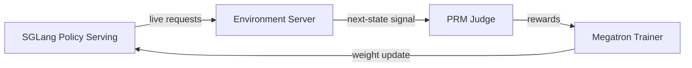

# OpenClaw-RL：让 Agent 边用边学——用 Next-State Signal 统一所有交互类型的在线 RL 训练

> 论文：[OpenClaw-RL: Train Any Agent Simply by Talking](https://arxiv.org/abs/2603.10165)
>
> 作者：Ling Yang 等（Gen-Verse）
>
> Agent 每次交互都在产生训练信号——用户回复、工具输出、终端状态变化——但现有系统全部丢弃了这些信号。OpenClaw-RL 是第一个将这些"免费"信号统一回收、实现 Agent 在线持续学习的 RL 框架。

---

## 一、这篇论文在解决什么问题

### 1.1 背景

当前 Agent RL 训练面临一个核心矛盾：**训练和部署是割裂的**。无论是 RLHF、DPO 还是 GRPO/DAPO，它们都在"先收集数据、再离线训练"的范式下运行。Agent 被部署后，每天处理大量用户请求、执行工具调用、与终端交互——这些交互天然产生了海量的反馈信号：用户说"不对"、工具返回错误、测试没通过——但这些信号被当作"上下文"传给下一轮，从未被回收为训练数据。

更糟糕的是，不同类型的 Agent 交互（对话、终端、GUI、SWE、工具调用）被视为完全不同的训练问题，各自需要专门的训练管线和数据管道。这导致了巨大的工程冗余和数据浪费。

### 1.2 核心问题

论文要回答两个问题：

1. **能否将所有 Agent 交互产生的 next-state signal 统一为在线学习源？** 即：对话中的用户回复、终端的 stdout/stderr、GUI 的状态变化、SWE 的测试结果——能否在同一个训练循环中使用？

2. **next-state signal 中除了"好/坏"的评价信息，还包含了"应该怎么做"的方向信息——能否将这种方向信息也转化为训练信号？**

---

## 二、方法：怎么解决的

### 2.1 核心 Insight

**Next-state signal 编码了两种可恢复的信息，而现有系统两种都在浪费：**

- **Evaluative signal（评价信号）**：用户重新提问 = 不满意，测试通过 = 做对了，报错 = 做错了。这本质是一个 process reward，可以直接转化为标量奖励。
- **Directive signal（指令信号）**：用户说"你应该先检查文件再编辑"，编译器给出详细错误信息——这不仅告诉你做错了，还告诉你**哪些 token 应该不同以及怎么改**。标量奖励完全无法捕捉这种信息。

OpenClaw-RL 同时恢复两种信号，通过两个互补的方法：Binary RL 和 Hindsight-Guided On-Policy Distillation (OPD)。

### 2.2 技术细节

#### Binary RL：从评价信号到标量奖励

给定 Agent 的响应 $a_t$ 和下一状态 $s_{t+1}$，PRM Judge 评分：

$$\text{PRM}(a_t, s_{t+1}) \rightarrow r \in \{+1, -1, 0\}$$

用 $m$ 次独立评估 + 多数投票确定最终奖励。训练使用标准的 PPO 裁剪替代目标，直接用 $A_t = r_{\text{final}}$ 作为 advantage。

关键细节：使用了**非对称裁剪**——上界 $\varepsilon_{\text{high}} = 0.28$ 大于下界 $\varepsilon = 0.2$，这意味着对正奖励的响应允许更大的策略更新幅度，鼓励模型更大胆地学习成功行为。

#### OPD：从指令信号到 token 级方向监督

这是论文最精彩的部分。OPD 的四步流程：

**Step 1 — Hindsight hint 提取**：Judge 从 $s_{t+1}$ 中提炼出 1-3 句简洁的"应该怎么做"的提示。注意：**不直接使用原始 $s_{t+1}$**，因为用户回复可能夹杂无关内容，Judge 的作用是提纯指令信号。

**Step 2 — 质量过滤**：只保留有效 hint（>10 字符），选最长（最具信息量）的。没有有效 hint？直接丢弃这个样本。OPD 用**样本数量换信号质量**。

**Step 3 — 增强教师构建**：把 hint 追加到原始 prompt 中，构造 $s_{\text{enhanced}} = s_t \oplus \text{hint}$。直觉上，这相当于"如果用户一开始就告诉你应该怎么做，你会怎么回答"。

**Step 4 — Token 级 advantage**：用同一个模型在增强 prompt 下对原始响应 $a_t$ 计算 log 概率，然后取差：

$$A_t = \log \pi_{\text{teacher}}(a_t | s_{\text{enhanced}}) - \log \pi_\theta(a_t | s_t)$$

- $A_t > 0$：知道 hint 的"老师"认为这个 token 应该加强
- $A_t < 0$：这个 token 应该抑制

这与标量奖励的本质区别在于：**同一个响应中，某些 token 被加强，某些被抑制**——这是 per-token 级别的方向引导，信息密度远超 $\{+1, -1\}$。

#### Binary + OPD 联合训练

两个方法共享 PPO 损失框架，差异仅在 advantage 计算。联合 advantage：

$$A_t = w_{\text{binary}} \cdot r_{\text{final}} + w_{\text{opd}} \cdot (\log \pi_{\text{teacher}}(a_t | s_{\text{enhanced}}) - \log \pi_\theta(a_t | s_t))$$

$w_{\text{binary}} = w_{\text{opd}} = 1$。Binary RL 提供**全覆盖粗粒度**信号（每个 scored turn 都有梯度），OPD 提供**局部高精度**信号（只在有 directive 信号的 turn 才有梯度，但精度极高）。

#### 异步四组件架构

四个组件完全解耦，异步运行，零协调开销。模型在服务用户的同时被训练——这是实现"边用边学"的系统基础。

### 2.3 方法对比

| 方法 | 信号类型 | 训练模式 | 是否需要外部 teacher | 信号粒度 | 数据需求 |
|------|---------|---------|-------------------|---------|---------|
| RLHF | 人类偏好 | 离线 | 是（reward model） | 序列级 | 大量标注 |
| DPO | 配对偏好 | 离线 | 否 | 序列级 | 配对数据 |
| GRPO/DAPO | 可验证奖励 | 批次 | 否 | 序列级 | 无标注但需批量 |
| **OpenClaw-RL Binary** | 交互信号 | **在线** | PRM judge | 序列级 | **零额外数据** |
| **OpenClaw-RL OPD** | 交互信号 | **在线** | **自身（增强上下文）** | **Token 级** | **零额外数据** |

---

## 三、实验结果

### 3.1 实验设置

**Personal Agent 实验**（模拟）：
- 模型：Qwen3-4B
- 场景 1（Student）：学生用 Agent 做作业，不想被发现在用 AI → Agent 需要学习自然写作风格
- 场景 2（Teacher）：老师用 Agent 批改作业，希望评语友好且具体 → Agent 需要学习评语风格

**General Agent 实验**：
- Terminal：Qwen3-8B，SETA 数据，128 并行环境
- GUI：Qwen3VL-8B-Thinking，OSWorld-Verified，64 并行环境
- SWE：Qwen3-32B，SWE-Bench-Verified，64 并行环境
- Tool-call：Qwen3-4B-SFT，DAPO 数据，32 并行环境

### 3.2 主要结果

**Personal Agent（核心发现）**：

| 方法 | 8 步更新 | 16 步更新 |
|------|---------|---------|
| Binary RL | 0.25 | 0.23 |
| OPD | 0.25 | 0.72 |
| **Combined** | **0.76** | **0.81** |

基线分数 0.17。几个关键解读：
- **Binary RL 单独效果有限**（0.25 → 0.23，甚至略降），因为标量奖励在风格个性化任务中信息密度太低
- **OPD 需要时间生效**：8 步时和 Binary RL 持平，但到 16 步时飙升到 0.72——因为 OPD 的训练样本稀疏（严格过滤），需要更多交互才能积累足够的高质量样本
- **Combined 方法最强**：0.81，比单独 Binary RL 提升 **3.5x**，比单独 OPD 提升 **12.7%**

**General Agent**：

| 设置 | 集成奖励 | 仅结果奖励 |
|------|---------|----------|
| Tool-call | **0.30** | 0.17 |
| GUI | **0.33** | 0.31 |

Tool-call 设置中，集成 process reward 带来 **76% 的相对提升**（0.17→0.30），验证了 next-state signal 作为过程奖励在长程 Agent 任务中的价值。

### 3.3 消融实验

论文最有说服力的消融是 Binary vs OPD vs Combined 的对比（Table 3）。它揭示了一个重要的动态：

- **早期**（8 步）：Binary RL 和 OPD 效果相当，但 Combined 已经显著领先（0.76 vs 0.25）——这说明两种信号的互补性在训练早期就发挥了作用
- **后期**（16 步）：OPD 独立表现爆发式增长（0.25→0.72），但 Combined 仍优于 OPD（0.81 vs 0.72）——Binary RL 的"全覆盖粗粒度"梯度为 OPD 提供了更稳定的训练基底

---

## 四、复现与落地评估

### 4.1 复现难度评估

| 维度 | 评级 | 说明 |
|------|------|------|
| 代码开源 | ✅ | [GitHub](https://github.com/Gen-Verse/OpenClaw-RL) 已开源，基于 slime 框架 |
| 数据可得性 | ✅ | Personal Agent 用 GSM8K（公开），General Agent 用公开 benchmark |
| 算力需求 | 高 | 需要同时运行 SGLang 推理 + Megatron 训练 + PRM Judge，最小配置估计 4×A100 |
| 依赖复杂度 | 高 | 依赖 slime、SGLang、Megatron 三个框架的协同，环境配置复杂 |
| 复现总评 | ⭐⭐⭐ | 代码开源是加分项，但系统复杂度高，需要较强工程能力 |

### 4.2 工业落地可行性

- **适用场景**：Personal Agent 持续优化（最直接的落地点）、大规模 Agent RL 训练平台
- **性能开销**：异步设计对推理延迟几乎零影响（graceful weight update），但需要额外的 PRM Judge 算力
- **集成难度**：需要在现有 Agent 框架中插入训练管线，对系统架构有侵入性
- **风险点**：在线训练的稳定性——策略可能因噪声信号（用户自身的错误被误判为 Agent 的失败）而退化
- **落地总评**：⭐⭐⭐ — 概念极其强大，但完整部署需要显著的基础设施投入

---

## 五、SOTA 对照矩阵

| 方法 | 核心思路 | 训练模式 | 信号粒度 | 是否在线 | 多场景统一 |
|------|---------|---------|---------|---------|----------|
| **OpenClaw-RL** | Next-state signal → Binary RL + OPD | 在线异步 | Token 级 | ✅ | ✅ 5 种场景 |
| GRPO/DAPO | 组内标准化可验证奖励 | 批次离线 | 序列级 | ❌ | ❌ 单场景 |
| RLAnything | Process + Outcome reward 集成 | 批次离线 | Step 级 | ❌ | ✅ 3 种场景 |
| DemyAgent | 数据质量 + reward model 优化 | 批次离线 | 序列级 | ❌ | ❌ 单场景 |
| Self-Rewarding | 自身作为 judge 迭代改进 | 离线迭代 | 序列级 | ❌ | ❌ |

**版图定位**：OpenClaw-RL 是**范式突破**而非增量改进——它第一次实现了从离线批量训练到在线持续学习的跨越，且统一了 5 种不同的 Agent 交互类型。OPD 的 token 级方向监督是方法论上的核心创新。

---

## 六、讨论与局限

### 6.1 论文自身讨论的局限

- Personal Agent 实验基于 LLM 模拟用户，不是真实用户交互
- General Agent 实验中 PRM Judge 需要额外算力资源
- 尚未在超大规模模型（>32B）上验证

### 6.2 我的额外观察

**1. PRM Judge 的准确性是整个系统的天花板**。如果 Judge 把用户的"追问"（其实是好奇，不是不满）判为负奖励，模型会学到错误信号。论文使用多数投票缓解，但根本问题未解决——尤其在 Personal Agent 场景，用户行为的噪声比 SWE 测试结果大得多。

**2. OPD 的"自蒸馏"假设需要质疑**。OPD 用同一个模型在增强上下文下作为"老师"——但如果模型本身能力不足，即使给了 hint，它也不能产生高质量的 token 分布。这意味着 OPD 的有效性可能与模型基础能力高度相关，较弱的模型可能无法从 OPD 中受益。

**3. 在线训练的稳定性风险**。论文的实验是在模拟环境中进行的短程训练（16-250 步）。在真实部署中，长期在线训练可能面临分布漂移、灾难性遗忘等问题。论文的 KL 惩罚（$\beta_{KL} = 0.02$）可能不足以防止长期退化。

**4. 隐私与安全**。Personal Agent 场景中，用户的对话内容被发送到 RL 服务器用于训练。虽然论文提到了 confidential API，但具体的隐私保护机制（差分隐私、联邦学习等）未详细讨论。

---

## 七、对我们的启示

**谁应该关注**：Agent 框架开发者、RL 研究者、Personal AI 产品团队

**核心 Takeaway**：

1. **Next-state signal 是被严重浪费的金矿**。如果你运行任何 Agent 服务，立即开始系统化地记录所有 next-state signal——这些是未来在线学习的训练数据
2. **OPD 的"同模型增强上下文 = 老师"是一个强大的范式**。不需要更强的外部 teacher，只需给模型"后见之明"的提示，就能产生比原始响应更好的 token 分布
3. **Binary RL 和 OPD 的互补性不是可选的优化，而是系统设计的必需**。前者提供覆盖面，后者提供精度——缺一不可
4. **统一训练循环的工程价值巨大**。5 种不同的 Agent 场景共用一个训练管线，极大降低了 RL 训练的系统复杂度

**实践建议**：

1. 在你的 Agent 系统中添加 next-state signal 的结构化日志——即使暂时不训练，这些数据的价值会随时间增长
2. 评估 OPD 的核心组件是否可以独立使用——hint 提取 + 增强上下文 + token 级 advantage 计算，不一定需要完整的在线 RL 管线
3. 关注 OpenClaw-RL 的开源代码进展，尤其是 Personal Agent 的真实用户实验结果

---

## 论文速查卡

| 项目 | 内容 |
|------|------|
| **标题** | OpenClaw-RL: Train Any Agent Simply by Talking |
| **作者** | Ling Yang 等, Gen-Verse |
| **链接** | [arXiv:2603.10165](https://arxiv.org/abs/2603.10165) |
| **发表** | 预印本, 2026-03-10 |
| **一句话总结** | 将所有 Agent 交互产生的 next-state signal（用户回复、工具输出、环境状态变化）统一回收为在线 RL 训练信号，通过 Binary RL（评价信号→标量奖励）和 OPD（指令信号→token 级方向监督）两种互补方法，实现 Agent 边用边学 |
| **大白话版** | 想象你有个助手，每次你跟他说"不对，应该先查文件"，他不但记住了"做错了"，还记住了"下次先查文件"这个具体建议——而且他在帮你干活的同时就在学，不用下班后专门补课 |
| **核心数字** | Combined 方法个性化得分 0.81（vs Binary RL 0.23 / OPD 0.72）；Tool-call 集成奖励 76% 相对提升 |
| **复现评级** | ⭐⭐⭐ |
| **落地评级** | ⭐⭐⭐ |
