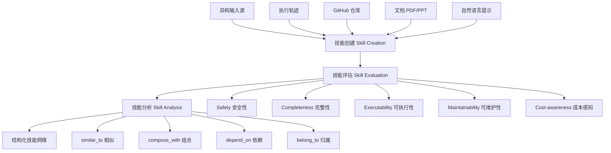

# SkillNet：给 AI Agent 建一个技能仓库

> 论文：[SkillNet: Create, Evaluate, and Connect AI Skills](https://arxiv.org/abs/2603.04448)
> 作者：Ruobin Zhong, Haoming Xu, Chen Jiang 等 40+ 人（浙大、同济、阿里、腾讯、蚂蚁等联合）
> 一句话总结：构建了一个 20 万+ 技能的开放基础设施，让 AI Agent 能系统地创建、评估和复用模块化技能，平均奖励提升 40%、执行步数减少 30%。

## 一、这篇论文在解决什么问题

### 1.1 背景

当前的 AI Agent（智能体）已经能调用工具、执行复杂任务了。但有一个尴尬的问题：**它们总在「重新发明轮子」**。每次遇到类似的任务，Agent 都是从零开始推理，不会把之前学到的「怎么做」存下来复用。

类比一下：想象一个程序员，每次写代码都不记得自己之前写过的函数，每次都要重新实现排序、解析 JSON、调 API……这就是当前 Agent 面临的困境。人类擅长把零散经验（episodic experience）内化为可复用的知识模式，但 AI Agent 还做不到。

现有的解决方案要么是手动编写 prompt（费人力），要么是 in-context learning（上下文学习，一次性的，不持久）。技能仓库虽然已经有一些（如 ClawHub、SkillsMP），但它们本质上是**静态的包管理器**——只负责存和下载，不负责自动创建、质量评估和技能间关系分析。

### 1.2 核心问题

论文聚焦两个关键缺失：

1. **没有统一的技能获取和积累机制**：开源仓库、论文、Agent 执行轨迹中蕴含大量可复用知识，但都是碎片化的、不可直接执行的
2. **没有系统的技能质量验证框架**：现有仓库靠 GitHub stars 或社区投票来判断质量，缺乏对安全性、可执行性、可维护性等维度的内在评估

## 二、方法：怎么解决的

### 2.1 核心 Insight

**把 Agent 的技能当作「知识工程」来做**——不仅仅是存储代码片段，而是构建一个有本体（Ontology）、有关系图、有质量评估的技能网络。技能不再是孤立的文件，而是网络中的节点，通过 `similar_to`、`compose_with`、`depend_on`、`belong_to` 四种关系互相连接。

这就像从"一堆散落的工具"进化到"一个有索引、有分类、有依赖管理的工具仓库"。

### 2.2 技术细节

SkillNet 的架构分为三大模块：

#### 技能本体（Skill Ontology）三层架构

| 层级 | 功能 | 示例 |
|------|------|------|
| Skill Taxonomy（分类层） | 10 大类 + 细粒度标签 | Development → frontend, llm, physics |
| Skill Relation Graph（关系层） | 四种关系边连接技能实体 | Matplotlib `compose_with` Pandas |
| Skill Package Library（包层） | 技能打包为可部署的模块 | data-science-visualization 包 |

#### 技能创建流程

SkillNet 用 LLM 从四类来源自动生成技能：
1. **执行轨迹和对话日志** → 提取操作模式
2. **GitHub 仓库** → 抽取可复用的功能模块
3. **PDF/PPT/Word 文档** → 结构化为步骤指令
4. **自然语言 prompt** → 直接生成技能

生成后经过多阶段管线：**去重**（MD5 哈希 + 目录结构比对）→ **过滤**（规则 + 模型联合）→ **分类打标** → **评估** → **入库**。

#### 五维评估框架

每个维度分 Good / Average / Poor 三级，由 GPT-5o-mini 自动评分：

| 维度 | 评估内容 | 质量分布 |
|------|----------|----------|
| Safety | 是否有危险操作（如删文件）、是否抗 prompt 注入 | 大部分 Good |
| Completeness | 步骤是否完整、依赖是否明确 | 大部分 Good/Average |
| Executability | 能否在沙盒中实际运行 | Average 占比较高（最难的维度） |
| Maintainability | 模块化程度、向后兼容性 | 大部分 Good |
| Cost-awareness | 执行时间、算力、API 调用成本 | 分布均匀 |

**评估可靠性验证**：随机抽取 200 个技能，3 位 CS 博士独立打分。自动评估器与人类评分的 MAE < 0.03，QWK（加权 Kappa）达到 1.000（近乎完美一致），说明 LLM 自动评估是可靠的。

## 三、实验结果

### 3.1 实验设置

在三个文本模拟环境上评估：
- **ALFWorld**：家庭环境中的物体导航和操作任务
- **WebShop**：模拟在线购物（搜索、比较、下单）
- **ScienceWorld**：虚拟科学实验室

基线方法：**ReAct**（推理+行动交替）和 **ExpeL**（从过去经验中提取自然语言洞察）

骨干模型：DeepSeek V3.2、Gemini 2.5 Pro、o4 Mini

### 3.2 主要结果

| 模型 | 方法 | ALFWorld Seen R↑ | ALFWorld Unseen R↑ | WebShop R↑ | ScienceWorld Seen R↑ | ScienceWorld Unseen R↑ |
|------|------|---|---|---|---|---|
| DeepSeek V3.2 | ReAct | 66.43 | 69.40 | 31.55 | 69.86 | 64.67 |
| | + SkillNet | **80.60** | **83.57** | **46.18** | **84.87** | **81.31** |
| Gemini 2.5 Pro | ReAct | 60.00 | 61.94 | 31.66 | 58.24 | 56.13 |
| | + SkillNet | **91.43** | **91.04** | **53.02** | **88.84** | **86.26** |
| o4 Mini | ReAct | 45.71 | 49.25 | 24.19 | 64.89 | 59.93 |
| | + SkillNet | **68.57** | **73.28** | **36.21** | **73.24** | **71.06** |

**关键解读**：

- **Gemini 2.5 Pro + SkillNet 提升最大**：ALFWorld 上从 60.00 → 91.43（+31.4），相当于从"及格线"跳到"优秀"
- **WebShop 提升最显著**：所有模型在 WebShop 上的提升比例最大（DeepSeek: 31.55 → 46.18, +46% 相对提升），说明购物这种多步骤、需要策略积累的场景最受益
- **Unseen 任务也大幅提升**：说明技能不只是记住了见过的答案，而是学到了可迁移的模式。如 DeepSeek 在 ScienceWorld Unseen 上从 64.67 → 81.31
- **执行步数平均减少 30%**：Agent 不再盲目探索，而是"知道该怎么做"

### 3.3 消融实验

论文没有设置传统意义上的消融实验（ablation），但通过对比 ReAct、ExpeL、Few-Shot 和 +SkillNet 四种方法，可以间接观察各组件贡献：

- **ExpeL vs ReAct**：加入经验总结后有稳定提升（如 DeepSeek ALFWorld: 66.43 → 67.86），但幅度有限
- **SkillNet vs ExpeL**：结构化技能 vs 松散经验，差距显著（如 Gemini ALFWorld: 68.57 → 91.43），说明**技能的结构化组织**远比简单的经验积累更有效
- **跨模型一致性**：o4 Mini（较弱模型）获得 +15.7 奖励提升，Gemini 2.5 Pro（强模型）获得 +28.5 提升，说明强模型更能利用好结构化技能

## 四、复现与落地评估

| 维度 | 评级 | 说明 |
|------|------|------|
| 代码开源 | ✅ | GitHub 开源，提供 skillnet-ai Python 包和 CLI 工具 |
| 数据可得性 | ✅ | 15 万+ 经过筛选的高质量技能已公开，API 可查询 |
| 算力需求 | 中 | 技能创建和评估依赖 LLM API 调用（GPT-5o-mini 等），实验使用 DeepSeek/Gemini/o4 Mini |

**实际落地路径**：论文专门展示了与 OpenClaw（开源个人 AI Agent 框架）的集成方案——Agent 在对话中自动搜索、下载、执行技能，并能将成功经验打包为新技能，形成闭环。

## 五、批判性分析

### 优势

1. **工程完整度极高**：不是一篇只有想法的论文，而是交付了完整基础设施（20 万+技能库、Python SDK、Web 平台、API）
2. **评估可靠性有保障**：LLM 评估器与人类评分 QWK=1.000 这个数字非常有说服力
3. **跨模型通用性**：在 3 个不同能力级别的模型上都有一致提升，不是为特定模型定制的
4. **开放生态理念**：支持社区贡献、自动质量检查、持续扩展

### 局限与疑问

1. **评估环境单一**：三个 benchmark（ALFWorld、WebShop、ScienceWorld）都是文本模拟环境，真实世界的 Agent 任务（如操作真实网页、调用真实 API）效果如何？论文缺乏验证
2. **技能创建质量存疑**：论文承认 Executability 评级中 Average 占比较高，说明自动生成的技能质量参差不齐。SkillsBench 研究也发现模型自生成的技能无法带来增益（+0 pp），只有人工策划的技能有效（+16.2 pp）——SkillNet 声称用 LLM 自动创建技能，但实验中用的是从专家轨迹合成的技能，两者有差异
3. **关系图的实际价值未量化**：四种关系（similar_to 等）在实验中是否被实际用到？对性能贡献多大？论文没有消融
4. **规模 ≠ 质量**：25 万候选 → 15 万筛选后入库，淘汰率 40%，但 15 万技能中有多少真正被 Agent 用到？存在长尾问题
5. **作者人数过多（40+人）**：来自 19 个机构，工程贡献和学术贡献的边界不够清晰

### 与相关工作对比

| 方案 | 定位 | 自动创建 | 质量评估 | 关系分析 | 技能数量 |
|------|------|----------|----------|----------|----------|
| **SkillNet** | 全生命周期基础设施 | ✅ LLM 管线 | ✅ 五维评估 | ✅ 关系图 | 15 万+ |
| ClawHub | npm 式包管理 | ❌ | ❌ | ❌ | ~9k |
| SkillsMP | 开源生态目录 | ❌ | ⚠️ GitHub stars | ❌ | ~261k |
| SkillHub | 付费市场 | ❌ | ⚠️ LLM 评级 | ⚠️ 手动 | ~21k |
| ExpeL | 经验提取框架 | ⚠️ 自然语言洞察 | ❌ | ❌ | N/A |

SkillNet 的核心差异化在于**全生命周期管理**——从创建、评估到关系建模的一条龙。但 SkillsMP 在绝对数量上更多（261k vs 150k），且 SkillNet 的质量优势需要更多真实场景验证。

## 六、论文速查卡

| 项目 | 内容 |
|------|------|
| 核心贡献 | 开放的 AI 技能基础设施，支持自动创建、五维评估、关系图构建，含 15 万+ 高质量技能 |
| 关键数字 | 平均奖励 +40%，执行步数 -30%，评估 QWK=1.000，25 万候选技能筛选至 15 万 |
| 适用场景 | Agent 系统的技能管理、任务规划加速、企业级知识工程、个人 AI Agent 增强 |
| 一句话评价 | 一个工程完整度远超学术论文平均水平的 Agent 技能基础设施，实验有说服力但真实场景验证不足 |
