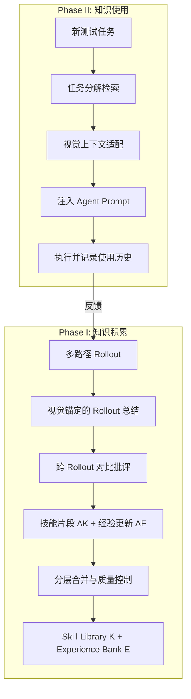

# XSkill：多模态 Agent 的双流持续学习框架——经验与技能的统一积累

> 论文：[XSkill: Continual Learning from Experience and Skills in Multimodal Agents](https://arxiv.org/abs/2603.12056)
>
> 作者：主要来自 NUS/清华等（具体见论文），ICML 投稿
>
> 一句话：XSkill 解耦了 Agent 的两种可复用知识——行动级"经验"和任务级"技能"——并通过视觉锚定的提取、对比性批评和分层合并，使冻结的多模态大模型无需训练即可持续学习，在工具使用、搜索和推理任务上平均提升 2.58–6.71 分。

---

## 一、这篇论文在解决什么问题

### 1.1 背景

多模态大语言模型（MLLM）已经能够操控多种工具——代码执行、网络搜索、图像分析。但在开放式任务中，当前 Agent 面临两个根本瓶颈：

1. **工具使用效率低**：简单问题花太多步骤，复杂问题又探索不够深——Agent 不会"从经验中学习"何时用哪个工具
2. **工具编排僵化**：大部分系统只走单路径执行，无法灵活组合工具应对不同任务——Agent 缺少可复用的"工作流模板"

人类通过两种知识解决这个问题：**经验**（"上次这种情况我用了旋转图片，效果很好"）和**技能**（"处理模糊图片的标准流程是：增强→裁剪→识别"）。但现有多模态 Agent 没有统一机制来积累和使用这两种知识。

### 1.2 核心问题

**如何让冻结的多模态 Agent 在不更新参数的前提下，从历史执行轨迹中持续积累行动级经验和任务级技能，并在新任务中检索、适配和使用这些知识？**

---

## 二、方法：怎么解决的

### 2.1 核心 Insight

XSkill 的关键洞察是：**Agent 的可复用知识天然分为两个互补层次，需要不同的提取和使用策略。**

- **经验（Experience）**：短小精悍的行动级知识，形式为 `(触发条件, 推荐动作)`。例如："当图片中文字模糊时→先用 OCR 增强再识别"。存储在 JSON 格式的 Experience Bank 中，通过语义向量检索。
- **技能（Skill）**：结构化的任务级工作流文档，包含元数据、工作流步骤和可复用代码模板。例如："图像内容识别流程 = [预处理→目标检测→文字识别→结果汇总]"。存储为 Markdown 文档的 Skill Library。

两者的关系：技能提供宏观的"怎么做"，经验提供微观的"注意什么"。技能告诉你用什么流程处理，经验告诉你在流程中每一步的陷阱和技巧。

### 2.2 技术细节

XSkill 的架构分两个阶段：

#### Phase I：知识积累

**Step 1: 多路径 Rollout + 视觉锚定总结**

对每个训练任务，执行 N 次独立 rollout 得到轨迹集 $\mathcal{R}_i = \{\tau_i^{(1)}, ..., \tau_i^{(N)}\}$。关键创新是 **视觉锚定（visually grounded）** 的总结——不只看文本 trace，还分析每一步的截图，记录"什么视觉证据驱动了什么决策"。

$$\mathcal{S}_{\mathcal{R}_i}, \Delta\mathcal{K}_i = \text{MLLM}_{\text{kb}}(\mathcal{R}_i, \mathcal{I}_i, q_i, y_i^*, \mathcal{K}_{\text{adapted}})$$

**Step 2: 跨 Rollout 对比批评（Cross-Rollout Critique）**

比较成功和失败轨迹的差异，找出因果因素：

$$\Delta\mathcal{E}_i = \text{MLLM}_{\text{kb}}(\mathcal{S}_{\mathcal{R}_i}, y_i^*, \mathcal{E}_{\text{ret}})$$

输出结构化的经验更新操作 $\{(add, e), (modify, e_{id}, e')\}$。每条经验被约束在 $L_{\text{max}}^e$ 字以内，确保精炼。

**Step 3: 分层合并（Hierarchical Consolidation）**

对经验：新经验入库前检查是否有余弦相似度超过 $\theta_{\text{sim}}$ 的已有条目，有则合并。库超过 $N_{\text{max}}^E$ 时自动删除低质量条目。

对技能：片段融入全局文档，文档超过 $L_{\text{max}}^K$ 时触发精炼——移除过于具体的细节，替换为可复用占位符。

#### Phase II：知识使用

**任务分解检索：** 将测试任务分解为 $n_g$ 个抽象子任务，每个子任务独立检索最相关的经验和技能。这比直接用原始 query 检索效果好得多。

**视觉上下文适配：** 检索到的知识不是直接注入——先根据当前任务的图像，用 MLLM 重写经验和适配技能，使其与当前视觉上下文匹配。

**非命令式注入：** 将适配后的知识注入 system prompt，但以"参考建议"而非"必须遵循"的方式，让 Agent 保持灵活性。

### 2.3 设计亮点对比

| 设计选择 | XSkill 的做法 | 之前工作的做法 | 为什么更好 |
|---------|-------------|-------------|----------|
| 知识形式 | 双流（经验+技能） | 单流（只有经验或只有 skill） | 覆盖宏观和微观两个决策层次 |
| 知识锚定 | 视觉锚定 | 纯文本 trace | 多模态任务中视觉信号是关键决策依据 |
| 知识提取 | 跨轨迹对比 | 单轨迹总结 | 对比成功/失败才能找到因果关系 |
| 知识管理 | 分层合并+质量控制 | 无限增长 | 控制库大小和检索噪声 |
| 模型分离 | exec 和 kb 用不同模型 | 同一模型 | 可以用更强的模型管理知识库 |

---

## 三、实验结果

### 3.1 实验设置

- **五个 Benchmark：** 覆盖视觉工具使用、多模态搜索、综合多模态推理
- **四个骨干模型：** 包括不同能力级别的 MLLM
- **基线：** Tool-only baseline（无学习）、Experience-only、Skill-only、以及其他 learning-based 方法

### 3.2 主要结果

XSkill 在所有骨干模型和 benchmark 上**一致且显著**地超越基线：
- **Average@4 提升 2.58–6.71 分**（相对 tool-only baseline）
- **最大单项提升 11.13 分**（在挑战性设置上 vs 最强基线）
- 跨模型迁移有效：用模型 A 积累的知识可以提升模型 B 的表现

关键数字解读：
- 2.58–6.71 分的提升在多模态推理任务上是**显著的**——这些任务本身正确率往往在 60-80% 范围
- 11.13 分的最大提升出现在需要复杂工具组合的场景，说明技能流的工作流模板确实在帮助 Agent 做更好的 planning

### 3.3 消融实验

论文做了详尽的消融分析，关键发现：

1. **经验和技能的互补性：** 单独使用经验或技能都有提升，但两者结合提升最大。经验主要提升"工具选择正确率"，技能主要提升"多步规划成功率"
2. **视觉锚定的必要性：** 去掉视觉锚定（只用文本 trace 提取知识），性能显著下降——特别是在需要视觉判断的任务上
3. **跨 Rollout 对比的价值：** 只用成功轨迹提取知识 vs 成功+失败对比提取，后者明显更好
4. **零样本泛化：** 在未见过的任务类型上仍有效，说明提取的知识具有泛化性

---

## 四、复现与落地评估

### 4.1 复现难度评估

| 维度 | 评级 | 说明 |
|------|------|------|
| 代码开源 | ⚠️ | ICML 投稿阶段，预计录用后开源 |
| 数据可得性 | ✅ | 使用公开 benchmark，无私有数据 |
| 算力需求 | 中-高 | 需要两个 MLLM 实例（exec + kb），多路径 rollout 成本较高 |
| 依赖复杂度 | 中 | 向量检索库、Markdown/JSON 知识库管理、多 rollout 调度 |
| 复现总评 | ⭐⭐⭐ |

### 4.2 工业落地可行性

- **适用场景：** 企业级多模态 AI 助手、客服 Agent 的知识积累、AutoGPT 类自主 Agent 的持续改进
- **性能开销：** 主要成本在知识积累阶段（多 rollout + MLLM 分析），推理阶段只增加检索和 prompt 注入的开销
- **集成难度：** 知识库是 Markdown + JSON 文件，与现有 Agent 框架的集成相对容易——OpenClaw 的 AGENTS.md/MEMORY.md 体系就是一个简化版的类似架构
- **风险点：** 知识质量强烈依赖 $\text{MLLM}_{\text{kb}}$ 的能力——如果 kb 模型不够强，提取的知识可能有噪声
- **落地总评：** ⭐⭐⭐

---

## 五、SOTA 对照矩阵

| 方法 | 核心思路 | 知识形式 | 是否需要训练 | 跨模型迁移 | 优势 | 劣势 |
|------|---------|---------|------------|-----------|------|------|
| **XSkill** | 双流经验+技能 | 经验(JSON) + 技能(MD) | ❌ | ✅ | 互补知识、视觉锚定、跨模型 | 多 rollout 成本高 |
| ExpeL | 经验学习 | 经验列表 | ❌ | ❌ | 简单直接 | 缺少任务级规划知识 |
| Voyager | 技能库 | 代码技能 | ❌ | ❌ | 适合游戏/代码 | 不适合多模态 |
| Anthropic Skills | 技能文档 | Markdown | ❌ | ❌ | 工业级实现 | 无自动积累机制 |
| 标准 RAG | 检索增强 | 文档片段 | ❌ | ❌ | 通用 | 知识未结构化 |

XSkill 的位置：**首次在多模态 Agent 中统一了行动级经验和任务级技能的双流学习，并通过视觉锚定解决了多模态场景中知识提取的"视觉-语义鸿沟"。** 是 Agent 持续学习方向的重要进展。

---

## 六、讨论与局限

### 6.1 论文自身讨论的局限

- 实验在"单次积累-测试"循环中验证，真正的持续学习需要多轮迭代
- 知识库管理的超参数（合并阈值、容量上限）对不同任务域可能需要调优
- 与 Anthropic（2026）的 skill 系统做了类比但缺少直接对比

### 6.2 我的额外观察

1. **知识冲突问题未讨论。** 当经验库中出现矛盾条目（"遇到模糊图片应该增强"vs"增强会引入伪影，应该直接降分辨率"），XSkill 的合并机制能否正确处理？

2. **与 RLHF/RL 的关系。** XSkill 是 training-free 的——用 prompt injection 代替参数更新。但这也意味着它的知识是"建议"而非"内化"，Agent 可能不稳定地遵循。与 ExeVRM 这样的 RL reward model 结合，先用 XSkill 积累知识，再用 RL 将知识内化到参数中，可能是更完整的路径。

3. **多路径 Rollout 的成本。** 每个训练任务执行 N 次 rollout，这在 API 调用成本上可能很高。论文未讨论 N 的最优值和 cost-performance tradeoff。

4. **OpenClaw 的联系。** OpenClaw 的 AGENTS.md + SOUL.md + memory/ 体系本质上就是 XSkill 的简化版——SOUL.md ≈ L0 skill document，memory/ ≈ experience bank，AGENTS.md ≈ meta-skill。XSkill 提供了将这个体系系统化和自动化的理论基础。

---

## 七、对我们的启示

**谁应该关注这篇论文？**
- 构建 AI Agent 产品的工程师（特别是多模态场景）
- 研究 Agent 记忆和知识管理的研究者
- 做 Agent 框架（LangChain/LlamaIndex/OpenClaw）的开发者

**核心 Takeaway：**

1. **Agent 知识的双流模型是对的。** 经验和技能服务于不同的决策层次，不能混为一谈
2. **视觉锚定是多模态 Agent 学习的关键。** 纯文本 trace 在多模态场景中信息不足
3. **跨 Rollout 对比 >> 单 Rollout 总结。** 失败和成功的对比才能提取因果知识
4. **知识管理需要主动维护。** 无限增长的知识库会引入噪声，需要合并、精炼和质量控制
5. **Training-free 学习是可行的。** 在模型冻结的前提下，仅通过外部知识管理就能实现持续改进

**实践建议：**
1. 在你的 Agent 系统中区分"经验"和"技能"的存储——前者是 JSON 列表（触发条件+动作），后者是结构化文档（工作流+模板）
2. 实现一个简单的 experience dedup 机制——新经验入库前用余弦相似度检查是否已有类似条目
3. 定期审查知识库质量，移除与实际表现不符的经验（XSkill 论文的 consolidation 思路）

---

## 核心四要素

| 要素 | 内容 |
|---|---|
| **根本问题** | 多模态 Agent 缺少 training-free 的持续学习机制：工具使用效率低、编排僵化，且现有知识提取方法无法处理视觉-语义鸿沟。 |
| **切入视角** | 将可复用知识解耦为互补的两个层次——行动级经验（tactical）和任务级技能（strategic），并用视觉锚定而非纯文本来提取和检索知识。 |
| **关键方法** | 双流框架：(1) 多路径 rollout + 跨轨迹对比批评提取知识；(2) 分层合并控制知识库质量；(3) 任务分解检索 + 视觉上下文适配注入。 |
| **核心发现** | 在五个 benchmark 和四个骨干模型上，双流学习一致提升 2.58–6.71 分（最高 11.13 分），且两个知识流的贡献是互补的、可跨模型迁移的。 |

## 方法公式化

**XSkill = (多路径 Rollout × 视觉锚定批评 → 经验 + 技能) + 分层合并 + 任务分解检索适配注入**

## 最终双重总结

**一句话总结（核心价值）：** XSkill 通过将多模态 Agent 的可复用知识解耦为行动级经验和任务级技能双流，配合视觉锚定的跨轨迹批评和分层知识管理，使冻结模型在无需训练的前提下实现了持续学习，跨五个 benchmark 和四个骨干模型一致提升 2.58–6.71 分。

**一句话总结（大白话版）：** 就像一个新手厨师既要积累"盐放多了怎么补救"这种小经验，又要学会"做红烧肉的标准流程"这种大技能——XSkill 让 AI 助手同时积累这两种知识，下次遇到类似问题就越做越好。

---

## 论文速查卡

| 项目 | 内容 |
|------|------|
| **标题** | XSkill: Continual Learning from Experience and Skills in Multimodal Agents |
| **作者** | 多机构合作 |
| **链接** | [arXiv:2603.12056](https://arxiv.org/abs/2603.12056) |
| **发表** | ICML 2026 投稿（预印本） |
| **一句话总结** | 双流框架统一行动级经验和任务级技能，使冻结多模态 Agent 实现 training-free 持续学习 |
| **大白话版** | AI 助手同时记"小窍门"和"标准流程"，做事越来越熟练 |
| **核心数字** | Average@4 提升 2.58–6.71 分，最大单项提升 11.13 分 |
| **复现评级** | ⭐⭐⭐ |
| **落地评级** | ⭐⭐⭐ |
