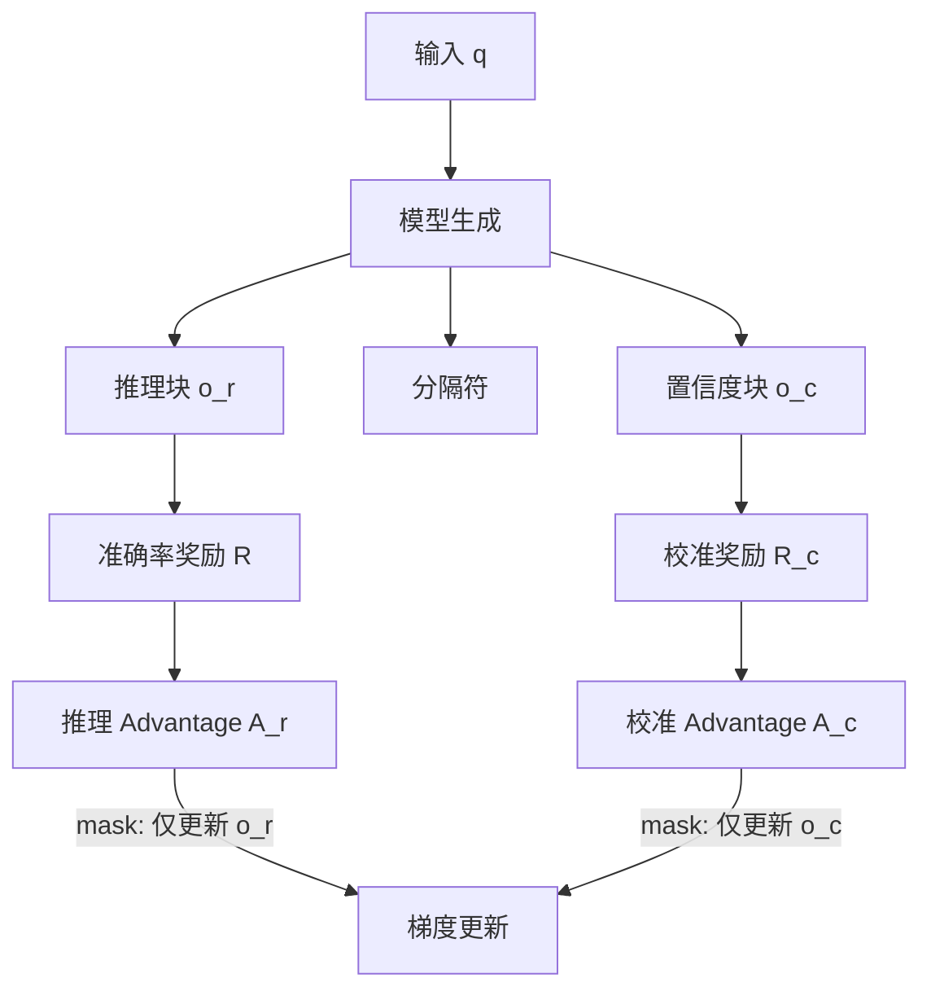

# 解耦推理与校准：DCPO 让 RLVR 模型不再盲目自信

> 论文：[Decoupling Reasoning and Confidence: Resurrecting Calibration in Reinforcement Learning from Verifiable Rewards](https://arxiv.org/abs/2603.09117)
>
> 作者：Xueru Wen, Boxi Cao, Yaojie Lu, Hongyu Lin 等（ICIP, CAS）
>
> RLVR 让模型推理更强但也更"狂妄"——答错了也 98% 自信。本文揭示准确率和校准之间存在**根本性梯度冲突**，提出 DCPO 框架将两者解耦，在保持 GRPO 同等准确率的同时将 ECE 从 0.435 砍到 0.128。

---

## 结构化摘要

| 维度 | 内容 |
|---|---|
| **背景/目标** | RLVR（如 GRPO）显著提升了 LLM 推理能力，但导致模型严重过度自信（overconfident），ECE > 0.3。现有方法试图联合优化准确率和校准，但陷入"准确率-校准权衡"困境 |
| **方法** | 理论证明准确率梯度和校准梯度的 Fisher 内积为负（根本性冲突）；提出 DCPO：block-wise 生成（推理 + 置信度分离）、解耦 advantage 估计、masked gradient 优化 |
| **结果** | Qwen3-8B + DCPO 在 5 个数学 benchmark 上准确率与 GRPO 持平（平均 +11.8%），ECE 从 0.435 降至 0.128（-71.6%），PCE 从 0.505 降至 0.212 |
| **结论** | 准确率与校准必须解耦优化；DCPO 提供了一个简洁有效的框架，代码已开源 |

---

## 一、这篇论文在解决什么问题

### 1.1 背景

RLVR（Reinforcement Learning from Verifiable Rewards）已成为 LLM 推理能力训练的核心方法。GRPO 等算法通过可验证奖励优化策略，在数学、代码、问答上取得了显著进步。

但一个被忽视的问题是：RLVR 训练的模型**严重过度自信**。即使答案完全错误，模型的输出概率（token-level confidence）也接近 1.0。在医疗、法律、金融等高风险场景，这种虚假自信可能导致灾难性决策。

实验数据触目惊心：所有主流模型（Qwen3、DeepSeek 等）的 ECE 均超过 0.3，GRPO 训练过程中平均置信度从 0.88 上升到 0.98，方差从 0.006 缩小到 0.001——模型越训越"确定"，不管对错。

### 1.2 核心问题

为什么现有的"联合优化"方法（如 RLCR、CCGSPG）总是陷入准确率-校准权衡？根本原因是什么？

### 1.3 研究缺口

RLCR 将 Brier Score 加入奖励，CCGSPG 根据 token confidence 修改 GRPO 目标——两者都尝试在**同一个梯度流**中同时优化准确率和校准。但没有人从理论上分析过这两个目标的梯度关系。

---

## 二、方法：怎么解决的

### 2.1 核心 Insight

**准确率和校准的梯度方向根本对立。**

设模型置信度为 $\text{Conf}_\theta(x)$，准确率目标为 $J_\text{acc}(\theta) = \mathbb{E}[R(y)]$，校准目标为 $J_\text{cal}(\theta) = -\ell(\text{Conf}_\theta, \mathbb{E}[R(y)])$。

当模型**过度自信**（$\text{Conf} > \mathbb{E}[R]$）时：

$$\langle \nabla_\theta J_\text{acc}, \nabla_\theta J_\text{cal} \rangle_{F^{-1}} = -\frac{\partial \ell}{\partial c} \cdot \text{Cov}_{\pi_\theta}(R(y), \phi(y)) < 0$$

Fisher 内积**严格为负**。直觉理解：提升准确率需要增加正确答案的概率（进一步推高置信度），而改善校准需要降低过高的置信度。两个方向相反，在同一梯度流中必然互相干扰。

### 2.2 DCPO 框架

解决方案的核心是**物理解耦**——让推理和置信度在不同的 token 上优化。

#### Block-wise 生成

模型输出被结构化为两段：$o = [o_r \;\; \texttt{<conf>} \;\; o_c]$

- $o_r$：推理过程和答案
- $o_c$：显式的置信度预测（verbalized confidence）

#### 解耦 Advantage 估计

推理 token 用标准 GRPO advantage：

$$A_{r,i} = \frac{R(o_{r,i}) - m_r}{\sigma_r}$$

置信度 token 用专门的校准 advantage。校准目标使用**混合信号**——实例级正确性和组级准确率的加权插值：

$$R_{IG} = \lambda \cdot \tilde{R}_G + (1-\lambda) \cdot R(o_r)$$

其中 $\tilde{R}_G = \frac{1}{G}\sum_{i=1}^G R(o_{r,i})$ 是组内平均准确率（无偏、低方差的不确定性估计）。

置信度奖励：$R_c(o_c) = -|\text{confidence}(o_c) - R_{IG}|$

#### Masked Gradient 优化

关键操作：推理 advantage 只更新推理 token 的梯度，校准 advantage 只更新置信度 token 的梯度：

$$\frac{1}{G}\sum_{i=1}^{G}\frac{1}{|o_i|}\left[\sum_{y_j \in o_r}\hat{\rho}_{i,j} A_{r,i} + \sum_{y_j \in o_c}\hat{\rho}_{i,j} A_{c,i}\right]$$

这从根本上消除了梯度冲突。

### 2.3 理论保证

**Theorem 5.1**：在解耦优化下，最优置信度预测器收敛到 $\mathbb{E}[c|q] = \mathbb{E}_{y \sim \pi_\theta}[R(y)]$，即真实的条件准确率。

**Proposition 4.3-4.4**：组级准确率 $\tilde{R}_G$ 是 $\mathbb{E}[R]$ 的无偏估计，方差为 $O(1/G)$，作为校准监督信号方差严格低于实例级信号。

---

## 三、实验结果

### 3.1 主要结果

在 Qwen3-8B 上，5 个数学 benchmark（MATH-500、AIME24/25、AMC23/24）：

| 方法 | 平均准确率 | AIME24 准确率 | AIME24 ECE | AIME24 PCE |
|------|-----------|-------------|-----------|-----------|
| Base Qwen3-8B | 49.0% | — | 0.435 | — |
| GRPO | **60.8%** | 40.0% | 0.370 | 0.505 |
| RLCR | 57.5% | 32.8% | 0.191 | 0.214 |
| CCGSPG | 58.4% | — | — | — |
| **DCPO** | **60.8%** | **41.6%** | **0.128** | **0.212** |

DCPO 准确率与 GRPO 持平，ECE 降低 71.6%。RLCR 虽然 ECE 也低，但准确率代价惨重（-7.2pp on AIME24）。

### 3.2 消融实验

| 消融 | 准确率 | ECE |
|------|--------|-----|
| Full DCPO | 60.8% | 0.128 |
| 去掉解耦（联合优化） | 57.3% (-3.5) | 0.258 |
| 仅用组级信号 | 60.8% | 0.209 |
| 仅用实例级信号 | 58.7% (-2.1) | 0.166 |
| Off-policy 校准 | 56.3% (-4.5) | 0.223 |

**解耦是最关键的组件**——去掉后 ECE 翻倍、准确率下降 3.5pp。

### 3.3 训练稳定性

梯度范数追踪显示：RLCR 和仅用实例级信号的变体有频繁的梯度尖峰，而 DCPO 梯度范数平滑稳定——验证了组级信号的低方差特性。

### 3.4 置信度分布

Base 模型和 GRPO 置信度分布极度右偏（大量样本在 0.95-1.0），RLCR 退化为两极分布（0 或 1）。DCPO 产生连续、均匀的置信度分布——模型真正学会了"我不太确定"。

---

## 四、复现与落地评估

### 4.1 复现难度评估

| 维度 | 评级 | 说明 |
|------|------|------|
| 代码开源 | ✅ | [github.com/icip-cas/DCPO](https://github.com/icip-cas/DCPO) |
| 数据可得性 | ✅ | DeepScaler 训练数据 + 标准评测集 |
| 算力需求 | 中 | Qwen3-8B，标准 GRPO 训练规模 |
| 依赖复杂度 | 低 | 在标准 GRPO 管线上的轻量修改 |
| 复现总评 | ⭐⭐⭐⭐⭐ | 代码开源 + 方法简洁 + 标准数据 |

### 4.2 工业落地可行性

- **适用场景**：任何需要模型给出可靠置信度的场景——医疗诊断辅助、法律风险评估、金融决策、自动驾驶
- **性能开销**：推理时仅多生成一个 `<conf>` 块（几个 token），开销可忽略
- **集成难度**：低——修改 GRPO 训练管线即可，推理时输出格式微调
- **风险点**：仅在数学任务上验证，泛化到开放域问答、代码等需要额外实验
- **落地总评**：⭐⭐⭐⭐ — 方法通用、成本低、已开源

---

## 五、SOTA 对照矩阵

| 方法 | 核心思路 | 准确率影响 | ECE | 过度自信缓解 |
|------|---------|-----------|-----|------------|
| **DCPO（本文）** | 解耦推理与校准的梯度流 | 无损（= GRPO） | **0.128** | ✅ 连续分布 |
| GRPO | 标准 RLVR | 基线 | 0.370 | ❌ 加剧 |
| RLCR | Brier Score 加入奖励 | 显著下降 (-7.2pp) | 0.191 | 部分 |
| CCGSPG | token confidence 调整目标 | 下降 (-3.2pp) | — | 部分 |
| ConfClass（post-hoc） | 训练后加分类器 | 无影响 | 0.363 | ❌ AUROC 低 |

**DCPO 是目前唯一做到"准确率无损 + 校准大幅改善"的方法。** 关键在于它不是在一个目标上做权衡，而是从根本上消除了冲突。

---

## 六、讨论与局限

### 6.1 论文自身讨论的局限

- 仅在数学推理 benchmark 上验证
- 依赖 verbalized confidence（需要模型学会输出格式）
- $\lambda$ 的选择需要调参

### 6.2 我的额外观察

1. **对 Agent 决策的意义**：Agent 需要根据自信程度决定是否请求人类帮助、是否执行高风险操作。DCPO 训练出的校准模型可以直接用于 Agent 的"不确定性感知"决策。

2. **与 Thinking to Recall 的互动**：Thinking to Recall 发现推理中的幻觉事实降低正确率。DCPO 的置信度如果能反映推理链中是否有幻觉，两者结合可以同时提升准确率和可靠性。

3. **Verbalized confidence vs Token probability**：论文同时测了两种置信度。Token probability 在 RLVR 后严重退化（方差趋近 0），而 verbalized confidence 可以通过训练来校准。这暗示 RLVR 对模型内部表示的"压缩"是结构性的，后训练修复比训练中修复困难得多。

4. **数学以外的场景**：开放域 QA 的"正确性"难以自动验证（verifiable reward 不适用），DCPO 如何扩展到这些场景值得探索。

---

## 七、对我们的启示

1. **谁应该关注**：RLVR/RLHF 训练工程师、需要可靠不确定性估计的应用开发者、AI 安全研究者
2. **核心 takeaway**：
   - RLVR 会系统性地摧毁模型校准——这不是 bug，是训练目标的数学必然
   - 准确率和校准之间存在**根本性梯度冲突**，联合优化注定次优
   - 解耦是唯一出路：让不同 token 负责不同目标
   - 组级准确率是廉价而有效的校准监督信号
3. **实践建议**：
   - 如果你在做 RLVR 训练，立即加入 DCPO——代码已开源，集成成本极低
   - 部署推理模型时，务必检测校准性能（ECE/PCE），不要只看准确率
   - Agent 系统中，用模型的 verbalized confidence 而非 token probability 来做不确定性决策

---

## 核心四要素

| 要素 | 内容 |
|---|---|
| **根本问题** | RLVR 让模型推理更强但严重过度自信，现有联合优化方法陷入准确率-校准权衡 |
| **切入视角** | 从梯度方向分析入手，证明准确率和校准目标的梯度在过度自信区域严格反向 |
| **关键方法** | 物理解耦——block-wise 生成 + masked gradient + 组级低方差校准信号 |
| **核心发现** | 解耦后准确率无损（= GRPO）而 ECE 降低 71.6%；联合优化的失败是数学必然 |

## 方法公式化

**可靠推理 = GRPO 准确率优化 ⊕ 解耦的 verbalized confidence 校准（组级 + 实例级混合信号）**

## 最终双重总结

**一句话总结**：通过理论证明 RLVR 训练中准确率和校准梯度根本性冲突，DCPO 将推理 token 和置信度 token 的优化完全解耦，首次在不牺牲推理能力的前提下将过度自信问题（ECE 0.435→0.128）大幅缓解。

**大白话版**：以前训练 AI 做数学题，训对了就奖励，结果 AI 学会了"不管对不对都表现得超级自信"。本文说：让 AI 先做题、再单独说"我有多确定"，两件事分开打分，这样 AI 就学会了"做得对就自信、不确定就老实说"。

---

## 论文速查卡

| 项目 | 内容 |
|------|------|
| **标题** | Decoupling Reasoning and Confidence: Resurrecting Calibration in RLVR |
| **作者** | Xueru Wen et al., ICIP / CAS |
| **链接** | [arXiv:2603.09117](https://arxiv.org/abs/2603.09117) |
| **代码** | [github.com/icip-cas/DCPO](https://github.com/icip-cas/DCPO) |
| **发表** | 预印本（2026-03-10） |
| **一句话总结** | 理论证明 RLVR 中准确率与校准梯度冲突，通过解耦优化实现无损准确率下 ECE 降低 71.6% |
| **大白话版** | 先做题再说"我有多确定"，两件事分开打分，AI 就不会"不懂装懂"了 |
| **核心数字** | ECE 0.435→0.128（-71.6%）；准确率无损（= GRPO）；AIME24 41.6% |
| **复现评级** | ⭐⭐⭐⭐⭐ |
| **落地评级** | ⭐⭐⭐⭐ |
