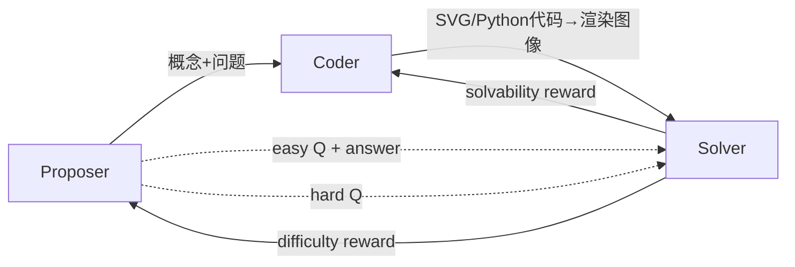

# MM-Zero：零数据三角色自进化，让 VLM 从无到有学会视觉推理

> 论文：[MM-Zero: Self-Evolving Multi-Model Vision Language Models From Zero Data](https://arxiv.org/abs/2603.09206)
>
> 作者：Zihao Li, Hongyang Du, Chengsong Huang 等 (UMD, Brown, Adobe, NVIDIA)
>
> VLM 的自我进化不再需要种子图像——用代码生成代替图像收集，用三个角色互相出题、渲染、解题，实现了真正的"零数据"自进化。

---

## 一、这篇论文在解决什么问题

### 1.1 背景

LLM 的自进化（self-evolving）已经成熟——AbsoluteZero、R-Zero 等工作证明了 LLM 可以不用任何人类标注数据，通过 RL 自我出题、自我提升。但 VLM（Vision Language Model）面临一个额外困难：它需要**图像**作为输入。

现有 VLM 自进化方法（VisPlay、EvolMM）虽然去掉了人类标注，但仍然依赖预先收集的静态图像数据集。这意味着模型的进化空间被图像数据集的分布、质量和多样性所限制——换了个瓶颈位置而已。

### 1.2 核心问题

**能否让 VLM 在完全不使用任何外部数据（包括图像）的条件下，通过自我进化提升多模态推理能力？**

## 二、方法：怎么解决的

### 2.1 核心 Insight

**用代码生成图像，把视觉 bootstrap 问题转化为代码执行问题。** 代码是确定性的、可验证的——渲染成功与否、渲染结果是否正确，都可以自动判断。这样就绕过了"从哪里获取图像"的难题。

### 2.2 技术细节

MM-Zero 从同一个 base model 初始化三个角色，各自用 GRPO 训练，训练时其余角色冻结：

**Proposer** 生成四元组 $(c, q_{easy}, a_{easy}, q_{hard})$：
- $c$：视觉场景的文字描述（如"一个饼图，30% 蓝色，50% 红色，20% 绿色"）
- $q_{easy}$：当图像正确渲染时显而易见的简单问题（用于验证渲染质量）
- $q_{hard}$：需要多步推理的困难问题（用于训练 Solver）

**Coder** 将描述转为可执行代码（SVG 或 Python），渲染为 PNG 图像。

**Solver** 对生成的图像进行多模态推理。

#### Reward 设计（核心工程）

这是论文最精巧的部分——三个角色各有独立的 reward，形成闭环。

**Proposer Reward** $R_p(x)$：

$$R_p = \frac{1}{N}\sum_{i=1}^{N} \mathbb{1}_{exec}(C_i) \cdot (\min(R_{solv}(I_i), 0.5) + R_{diff}(I_i)) + r_{eh} + r_{ct} + r_{div}$$

六个组件各司其职：
1. **执行成功率** $\mathbb{1}_{exec}$：代码能否运行。代码不能跑 = 0 分
2. **可解度** $R_{solv}$：Solver 回答 easy question 的正确率（验证渲染是否忠实）。**上限 0.5**——避免 Proposer 只生成简单题
3. **难度分** $R_{diff} = \min(c_i, 1-c_i)$：Solver 对 hard question 的自一致性。**峰值在 0.5**（Solver 最不确定时），体现 Goldilocks 原则——太简单和太难都不好
4. **Easy-Hard 惩罚** $r_{eh}$：hard question 如果太简单，罚 $-0.3$
5. **内容类型多样性** $r_{ct}$：某类型占 batch 超 50% 时惩罚
6. **文本多样性** $r_{div}$：用聚类检测重复 caption/question

数值例子：假设 Proposer 生成一个饼图场景，4 个 Coder rollout 中 3 个渲染成功，Solver 在 easy question 上 80% 正确（$R_{solv}=0.8$，截断为 0.5），在 hard question 上 60% 自一致（$R_{diff}=\min(0.6, 0.4)=0.4$）。总分 ≈ $\frac{3}{4} \times (0.5 + 0.4) = 0.675$（加上多样性奖惩）。

**Coder Reward** $R_D = R_{render} + R_{solv} + R_{diff} - \lambda_{err}$

直接奖励：渲染成功 +1，加上 Solver 可以解题。

**Solver Reward**：采用 TTRL（Test-Time RL），用多数投票的答案作为 silver label。

$$R_S(y_k) = 0.9 \cdot \mathbb{1}(\hat{y}_k = \bar{y}) + 0.1 \cdot R_{fmt}(y_k)$$

#### 数据过滤

精心设计的 Goldilocks 过滤：
- Coder：只保留渲染成功率在 25%-75% 的样本（不太难也不太简单）
- Solver：easy question 正确率 > 50%，hard question 正确率在 27%-75%

### 2.3 方法对比

| 方法 | 是否需要图像数据 | 角色数 | 自进化方式 | 视觉内容来源 |
|------|:---:|:---:|------|------|
| VisPlay | 是 | 2 | Proposer-Solver | 静态数据集 |
| EvolMM | 是 | 2 | Proposer-Solver | 静态数据集 |
| Vision-Zero | 是 | 2 | Proposer-Solver | 静态数据集 |
| **MM-Zero** | **否** | **3** | **Proposer-Coder-Solver** | **代码生成** |

## 三、实验结果

### 3.1 实验设置

- **Base models**：Qwen3-VL-4B/8B, MiMo-VL-7B
- **硬件**：8× RTX 6000 Pro 96GB
- **训练**：每个角色 20 步，共 60 步迭代
- **评估**：MMMU, MMMU-Pro, ChartQA, MM-Vet, MathVerse, MathVision, MathVista, VisNumBench, HallusionBench, MMSI

### 3.2 主要结果

Qwen3-VL-4B 上的 MM-Zero 提升（部分关键指标）：

| Benchmark | Base | MM-Zero | Δ |
|-----------|:----:|:-------:|:---:|
| MathVerse | 34.8 | **37.2** | +2.4 |
| MathVista | 64.5 | **66.8** | +2.3 |
| VisNumBench | 25.0 | **27.3** | +2.3 |
| ChartQA | 74.3 | **76.1** | +1.8 |
| MMMU | 50.3 | **51.6** | +1.3 |

这些提升来自**零外部数据**——模型完全靠自我生成的 SVG/Python 图像和问题训练。在数学视觉推理（MathVerse, MathVista, VisNumBench）上提升最显著，说明代码生成的几何图形和图表确实能训练出可迁移的视觉推理能力。

Qwen3-VL-8B 和 MiMo-VL-7B 上也观察到一致的提升趋势。

### 3.3 消融实验

- **去掉 Coder**（退化为双角色）：性能显著下降，验证了三角色架构的必要性
- **去掉 Goldilocks 难度过滤**：训练不稳定，Proposer 趋向生成过于简单或过于困难的题目
- **去掉多样性惩罚**：Proposer 趋向模式坍缩，重复生成相似场景

## 四、复现与落地评估

### 4.1 复现难度评估

| 维度 | 评级 | 说明 |
|------|------|------|
| 代码开源 | ✅ | GitHub 已开源 |
| 数据可得性 | ✅ | 零数据，不需要外部数据 |
| 算力需求 | 高 | 8× RTX 6000 Pro 96GB，三角色交替训练 |
| 依赖复杂度 | 中 | 需要 vLLM 部署三个模型服务，SVG/Python 渲染环境 |
| 复现总评 | ⭐⭐⭐⭐ |

### 4.2 工业落地可行性

- **适用场景**：VLM 后训练增强，特别是数据稀缺的垂直领域
- **性能开销**：训练成本较高（三角色并行），但推理时只用 Solver
- **集成难度**：训练框架独立，产出的 Solver 可直接部署
- **风险点**：代码生成的图像偏向结构化图形（图表、几何），自然图像场景受限
- **落地总评**：⭐⭐⭐

## 五、SOTA 对照矩阵

| 方法 | 核心思路 | 数据需求 | 关键指标 | 优势 | 劣势 |
|------|---------|---------|---------|------|------|
| **MM-Zero** | 三角色 RL 自进化 | 零 | MathVerse +2.4 | 无需任何数据 | 限于结构化视觉 |
| VisPlay | 双角色自进化 | 需要种子图像 | - | 更简单的训练流程 | 受限于种子数据 |
| AbsoluteZero (LLM) | 双角色代码自进化 | 零 | - | 已验证于纯文本 | 不处理视觉 |
| RLVR + SFT (传统) | 人类标注 SFT | 大量标注 | - | 上限高 | 标注成本高昂 |

MM-Zero 是**范式突破**——首次证明 VLM 可以零数据自进化。但提升幅度尚为增量级（1-3 分），距离取代 SFT 还有距离。

## 六、讨论与局限

### 6.1 论文自身讨论的局限

- 代码生成的视觉内容主要是 SVG/matplotlib 图形，与自然图像差距大
- 训练计算成本较高（三角色交替，每步都需要推理其他两个角色）
- TTRL 的 silver label 质量取决于 Solver 自身能力

### 6.2 我的额外观察

**1. Sim-to-Real Gap 是关键瓶颈。** 论文在 MathVerse（几何推理）上提升最大、在 MMMU（需要自然图像理解）上提升最小——这恰好说明代码渲染的结构化图像和自然图像之间存在显著的域差距。如果只关注图表、几何类任务，MM-Zero 很有价值；但要成为通用 VLM 增强方法，需要更丰富的视觉生成手段。

**2. Goldilocks 原则的普适性。** $R_{diff} = \min(c_i, 1-c_i)$ 这个设计非常优雅——它让自进化系统天然寻找"刚好在能力边界"的训练样本。这个思路可以直接迁移到 LLM 自进化、Curriculum Learning 等场景。

**3. 三角色 vs 双角色的本质区别。** Coder 角色的引入不仅是"多了一个参与者"，而是将**不可验证**的视觉生成转化为**可验证**的代码执行。这是一种"通过引入中间可验证表示来解锁 RL 训练信号"的通用范式。

**4. 计算效率存疑。** 论文未详细报告总训练时间和成本。三角色交替训练意味着每个角色的每一步都需要调用其他两个模型做推理——对于 8B 模型在 8 卡上，这个开销不容忽视。

## 七、对我们的启示

1. **谁应该关注？** VLM 研究者、多模型 RL 系统设计者、数据效率关注者
2. **核心 takeaway**：
   - 代码生成是弥合文本→视觉模态的优秀桥梁
   - Goldilocks 难度调节（$\min(c, 1-c)$）是自进化系统的通用设计模式
   - 三角色 > 双角色的关键在于引入可验证中间表示
3. **实践建议**：如果你的 VLM 应用场景涉及结构化视觉（图表、几何、UI），可以用 MM-Zero 做低成本后训练增强

## 论文速查卡

| 项目 | 内容 |
|------|------|
| **标题** | MM-Zero: Self-Evolving Multi-Model Vision Language Models From Zero Data |
| **作者** | Zihao Li 等, UMD / Brown / Adobe / NVIDIA |
| **链接** | [arXiv:2603.09206](https://arxiv.org/abs/2603.09206) |
| **发表** | 预印本 |
| **一句话总结** | 首个零数据 VLM 自进化框架：Proposer 出题 + Coder 用代码渲染图像 + Solver 推理，三角色 GRPO 训练无需任何人类标注 |
| **大白话版** | 三个学生互相出题：一个想题目和画面描述，一个写代码画出来，一个看着图答题。他们互相评分、越来越厉害——全程没有老师参与 |
| **核心数字** | MathVerse +2.4，MathVista +2.3（零数据训练） |
| **复现评级** | ⭐⭐⭐⭐ |
| **落地评级** | ⭐⭐⭐ |
