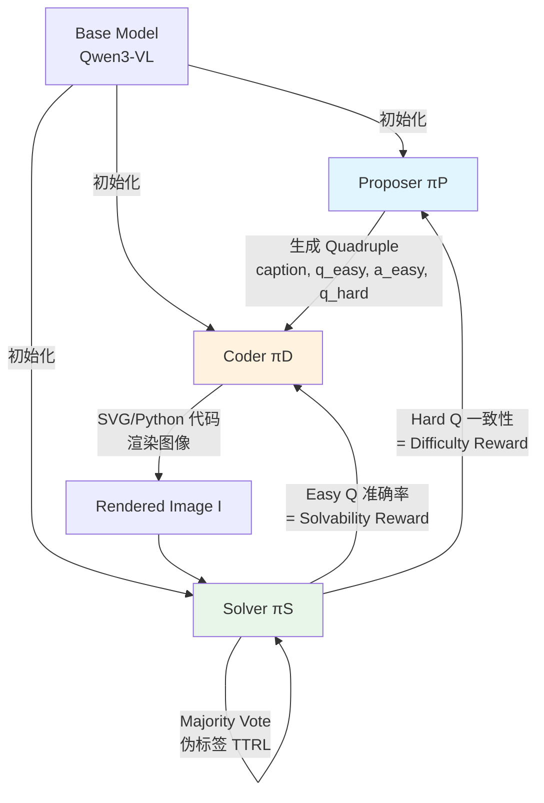

## 论文速查卡

| 维度 | 内容 |
|------|------|
| 📄 标题 | MM-Zero: Self-Evolving Multi-Model Vision Language Models From Zero Data |
| 🔗 链接 | [arXiv 2603.09206](https://arxiv.org/abs/2603.09206) · [GitHub](https://github.com/zli12321/MM-Zero) |
| 🏛️ 机构 | UMD, Brown, WUSTL, Adobe, UIUC, USC, NVIDIA |
| 📅 日期 | 2026-03-10 |
| 一句话总结 | 首个零外部数据 VLM 自进化框架：Proposer 出题 → Coder 用代码渲染图像 → Solver 做多模态推理，三角色 GRPO 闭环训练 |
| 大白话版 | 让 VLM 自己出考试题、自己画考试图、自己答题来提升自己，全程不需要任何人类标注的数据 |
| 核心数字 | Qwen3-VL-8B: 50.7% → 56.6%（+5.9pp, 5 轮迭代）；渲染成功率 ~40% → 70%+ |
| 评级 | ⭐⭐⭐⭐ 方法创新性强，但合成图像与真实图像的 gap 是关键局限 |

---

## 核心 Insight

**VLM 自进化的根本瓶颈不是标注成本，而是图像数据依赖**。之前的 VLM 自进化工作（VisPlay, EvolMM, Vision-Zero）虽然去掉了人工标注，但仍需种子图像数据集来启动训练循环。MM-Zero 的核心突破是引入 **Coder 角色**——用代码（SVG/Python）程序化渲染图像，从而将"自进化"的范围从"文本-only"扩展到"文本+视觉"。

这启发了一个更深层的洞察：**代码是连接抽象概念和具体感知的最佳桥梁**。Proposer 用自然语言描述视觉场景，Coder 将其翻译为精确的可执行指令，Solver 在渲染结果上推理——这三者形成了从"概念 → 实现 → 验证"的完整认知循环。

---

## 技术细节

### 整体架构

### 三角色训练循环

训练按轮次顺序进行，每轮训练一个角色（其余冻结），每 20 步保存 checkpoint：

1. **Proposer 训练**：生成 (caption, q_easy, a_easy, q_hard) 四元组 → Coder 渲染 → Solver 评估 → 计算组合奖励
2. **Coder 训练**：使用最新 Proposer checkpoint 生成 ~4000 个 caption → 训练生成 SVG 代码渲染图像
3. **Solver 训练**：使用最新 Proposer + Coder 生成训练数据 → TTRL 自训练

### Proposer 奖励设计（核心创新）

Proposer 的奖励 R_p(x) 是最复杂的，包含 6 个组件：

| 组件 | 公式/说明 | 值域 | 作用 |
|------|-----------|------|------|
| 执行指示器 | 1_exec(C_i) | {0, 1} | 代码是否成功渲染 |
| Solvability | R_solv = (正确回答 easy Q 的 rollout 比例) | [0, 1]，上限 0.5 | 渲染图像是否忠实于 caption |
| Difficulty | R_diff = min(c_i, 1-c_i)，c_i 是 hard Q 多数投票一致性 | [0, 0.5] | **在 c_i=0.5 时最大化**（Goldilocks） |
| Easy-Hard 惩罚 | 平均 R_diff < 0.15 时 -0.3 | {-0.3, 0} | 防止 hard Q 太简单 |
| 内容类型多样性 | 同类型占比 > 50% 时惩罚 | [-0.15, 0] | 鼓励跨领域出题 |
| Caption/问题多样性 | 基于聚类的重复惩罚/奖励 | [-0.5, 0.5] | 防止重复 |

**数值例子**：假设 Proposer 生成一道图表推理题，4 个 Coder rollout 中 3 个成功渲染（成功率 75%），Solver 在 easy Q 上 4/5 正确（R_solv = 0.8, capped at 0.5），hard Q 上 3/5 一致（c_i = 0.6, R_diff = min(0.6, 0.4) = 0.4），无惩罚项。则单张图的贡献 ≈ 0.5 + 0.4 = 0.9。

### Solver 的 TTRL 机制

由于 hard Q 没有 ground truth，Solver 使用 **Test-Time RL**：

$$R_S(y_k) = 0.9 \cdot \mathbb{1}(\hat{y}_k = \bar{y}) + 0.1 \cdot R_{fmt}(y_k)$$

其中 ȳ = Mode({y_1, ..., y_K}) 是多数投票得到的伪标签。这是一个"自举"过程——用模型自己的共识作为训练信号。

### 数据过滤策略

- **Coder 过滤**：只保留渲染成功率在 25%-75% 之间的 caption（排除太简单或太难渲染的）
- **Solver 过滤**：easy Q 准确率 > 50% 且 hard Q 准确率在 27%-75% 之间

---

## 实验结果

### 主实验：Solver 在多模态 benchmark 上的表现

| 模型 | Iter | MMMU | ChartQA | MathVerse | MathVision | MathVista | VisNumBench | HalluBench | Avg |
|------|------|------|---------|-----------|------------|-----------|-------------|------------|-----|
| Qwen3-VL-4B | Base | - | - | - | - | - | - | - | 50.2 |
| Qwen3-VL-4B | Iter3 | - | - | - | - | - | - | - | **53.4** |
| Qwen3-VL-8B | Base | - | - | - | - | - | - | - | 50.7 |
| Qwen3-VL-8B | Iter3 | - | - | - | - | - | - | - | 54.1 |
| Qwen3-VL-8B | **Iter5** | - | - | - | - | - | - | - | **56.6** |
| Mimo-VL-7B | Base | - | - | - | - | - | - | - | 50.9 |
| Mimo-VL-7B | Iter3 | - | - | - | - | - | - | - | **56.0** |

**关键解读**：
- **8B > 4B 差距显著**：4B 模型只提升 3.2pp vs 8B 的 5.9pp，原因是 4B 的渲染成功率仅 40%（vs 8B 的 70%），有效训练样本量不足
- **5 轮迭代仍未饱和**（56.6% at Iter5），暗示更长训练可能带来更多收益
- **视觉数学推理获益最大**：从 seed topic 设计（chart, geometry, math）可以预期
- **跨模型泛化**：Mimo-VL-7B（非 Qwen 家族）同样有效，证明框架的通用性

### Coder 渲染质量演进

| 训练阶段 | 渲染成功率 | 图像质量 | 问题难度 |
|----------|-----------|---------|---------|
| Base | ~40% (4B) / ~55% (8B) | 布局混乱，元素重叠 | - |
| Iter 1 | ~55% / ~65% | 布局改善，但答案常直接标注在图中 | Easy |
| Iter 2 | ~60% / ~68% | 更清晰，hard Q 需要多步推理 | Medium |
| Iter 3 | ~65% / ~70%+ | 专业级图表，需组合推理 | Hard |

### 消融实验亮点

- **去掉 Difficulty Reward**：Proposer 倾向生成极简单的问题，Solver 提升大幅减少
- **去掉 Content-Type Diversity**：训练坍缩到单一图表类型
- **去掉 Coder（直接用文本描述）**：无法形成视觉推理能力

---

## 复现与落地评估

| 维度 | 评分 | 说明 |
|------|------|------|
| 📊 数据可得性 | ⭐⭐⭐⭐⭐ | **零数据**——这是核心卖点 |
| 💻 计算需求 | ⭐⭐⭐ | 8x RTX 6000 Pro 96GB，60 步/角色，总体可接受但不便宜 |
| 🔧 代码完备性 | ⭐⭐⭐⭐ | GitHub 已开源，基于 vLLM + GRPO |
| 📐 方法复杂度 | ⭐⭐ | 三角色交替训练 + 6 种奖励 + 数据过滤，工程复杂度高 |
| 🔄 迁移泛化 | ⭐⭐⭐ | 跨模型有效，但合成→真实图像的 gap 未验证 |

---

## SOTA 对照矩阵

| 方法 | 需要种子图像 | 角色数 | 训练算法 | 8B 提升 | 开源 |
|------|-------------|--------|---------|---------|------|
| **MM-Zero** | ❌ | 3 (Proposer-Coder-Solver) | GRPO + TTRL | +5.9pp | ✅ |
| VisPlay | ✅ | 2 (Proposer-Solver) | Self-Play | ~+3pp | ✅ |
| EvolMM | ✅ | 2 (Proposer-Solver) | SFT | ~+2pp | ✅ |
| Vision-Zero | ✅ (少量) | 2 | GRPO | ~+4pp | ✅ |
| Absolute Zero (LLM) | ❌ | 2 | RL + Code Exec | N/A (文本) | ✅ |

---

## 批判性分析：我的额外观察

1. **合成图像的天花板**：SVG/Python 渲染的图像本质上是"图表、几何图形、简单场景"的模拟——这与真实世界图像（自然光照、复杂纹理、遮挡）差距巨大。论文回避了这一点，没有在 ImageNet-based VQA 或 real-world 场景上测试。

2. **TTRL 的自举风险**：当所有 rollout 都犯同一个错误时，多数投票产生错误伪标签，强化训练会锁定错误模式。论文没有分析这种情况的发生频率和影响。

3. **Goldilocks 原则的优雅与局限**：difficulty reward 在 c_i=0.5 时最大化是优雅的设计，但它依赖 Solver 的能力作为难度参照——如果 Solver 本身在某个领域完全无能（c_i ≈ 0 或 1），这个信号就失效了。

4. **代码作为视觉接地**：这是论文最深刻的贡献——用可执行代码作为抽象概念到视觉感知的桥梁。这个思路可以扩展到 3D 场景（Blender script）、物理模拟（MuJoCo/Isaac）等领域。

5. **未回答的关键问题**：5 轮迭代后性能曲线的斜率是递减还是递增？如果递减，ceiling 在哪里？如果递增，是否意味着更长训练能无限提升？
