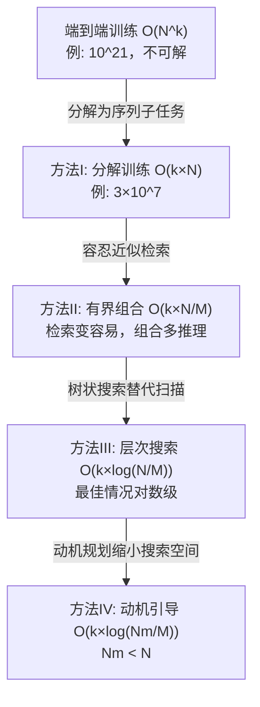

# MOOSE-Star：把科学发现的训练复杂度从指数级降到对数级

> 论文：[Unlocking Tractable Training for Scientific Discovery by Breaking the Complexity Barrier](https://arxiv.org/abs/2603.03756)
> 作者：Zonglin Yang 等人
> 一句话总结：将科学假设生成的训练问题从不可解的 O(N^k) 分解为可解的 O(log N)，并发布了 10 万篇论文的结构化数据集。

## 一、这篇论文在解决什么问题

### 1.1 背景

大语言模型（LLM）在科学发现中展现了潜力，但现有工作几乎都聚焦在**推理阶段**——即给模型一个已有的假设，用外部反馈（如同行评审、数据拟合）来迭代改进它。这就好比教一个人"如何修改作文"，但从没教过他"如何从零写出一篇作文"。

真正的核心问题是**直接训练** P(hypothesis|background)——给定研究背景，直接生成高质量假设。这个过程对应的是科学家最核心的创造性工作：从已有知识出发，找到关键灵感并组合成新发现。然而，至今没有人成功训练过这个分布，原因在于其**组合爆炸**的复杂度。

举个例子：反向传播算法的发现，可以看作将"多层逻辑回归"（背景）与"链式法则"（灵感）组合而成。问题在于，当灵感来源是全球约 10^7 篇论文、且需要组合 k 个灵感时，搜索空间是 O(N^k)——当 N=10^7, k=3 时，这意味着约 10^21 种可能，端到端训练根本不可能收敛。

### 1.2 核心问题

**如何将科学假设生成 P(h|b) 的训练从数学上不可解（O(N^k)）变为可解且可扩展的？**

## 二、方法：怎么解决的

### 2.1 核心 Insight

**把一个不可解的联合分布分解为一系列可独立学习的子任务。** 科学发现 = 依次检索灵感 + 逐步组合假设。这不是新想法（MOOSE-Chem 提出过），但 MOOSE-Star 的关键贡献是**首次将这个分解用于训练**，并配合三个技术创新把复杂度一路降到对数级。

### 2.2 技术细节

整体框架分四步递进降低复杂度：

**方法 I：分解序列训练**

核心公式将 P(h|b) 分解为 k 步的乘积：

$$P(h|b) \approx \prod_{j=1}^{k} P(i_j | b, h_{j-1}, \mathcal{I}) \cdot P(h_j | b, h_{j-1}, i_j)$$

第一项是**灵感检索**（从 N 篇论文中选对的那篇），第二项是**假设组合**（用选中的灵感更新假设）。训练时分别学这两个子任务：
- **IR 模型**：给 15 篇候选论文（1 正 14 负），选出正确灵感——本质是分类任务
- **HC 模型**：给定正确灵感，生成增量假设 Δh——生成任务

基座模型用 DeepSeek R1-Distilled-Qwen-7B，通过教师模型（32B）做拒绝采样微调（RFT）。

**方法 II：有界组合**

放宽检索的精确度要求：不要求找到**精确**的灵感论文 i*，只要找到语义上足够接近的论文（在余弦相似度 0.90-0.97 范围内），HC 模型就能"脑补"出正确的假设。

实际操作：用 SPECTER2 嵌入论文，按相似度分三档——Easy (0.94-0.97)、Medium (0.92-0.94)、Hard (0.90-0.92)，训练时刻意用最难的近似灵感做输入，逼模型学会容错推理。

**方法 III：层次搜索**

把全部论文用层次 K-means 聚类组织成树（最大分支因子 15），推理时用 Best-First Search 自顶向下搜索。路径评分用几何平均归一化：

$$\text{Score}(path_j) = \left(\prod_{t=0}^{j} p_t\right)^{1/(j+1)}$$

这样深层节点不会因为概率连乘而被不公平地惩罚。

**方法 IV：动机规划**

在检索前先生成一个"动机"变量 m——描述"我想往什么方向找灵感"。这是一次轻量推理（O(1)），但能有效剪枝无关分支，把搜索空间从 N 缩小到 N_m。

## 三、实验结果

### 3.1 实验设置

- **数据集 TOMATO-Star**：108,717 篇论文（NCBI 数据库，涵盖生物、化学、认知科学，2020.1-2025.10）
- **时间切分**：2025.10 为测试集，严格无泄漏
- **数据处理成本**：38,400 A800 GPU 小时（约 4.4 GPU 年）
- **模型**：基于 R1-Distilled-Qwen-7B 微调
- **评估指标**：M3 分数（Motivation + Mechanism + Methodology，各 0-4 分，总分 12）

### 3.2 主要结果

**灵感检索（IR）：**

| 模型 | 准确率 |
|------|--------|
| 随机选择 | 6.70% |
| R1-Distilled-Qwen-7B（基线） | 28.42% |
| MS-IR-7B（微调后） | **54.37%** |

微调带来 **+25.95 个百分点**的提升，是基线的近 2 倍。

**假设组合（HC，给定精确灵感）：**

| 模型 | 总分 | Motivation | Mechanism | Methodology |
|------|------|-----------|-----------|-------------|
| R1-Distilled-Qwen-7B | 4.34 | 1.96 | 1.40 | 0.97 |
| MS-HC-7B | 5.08 | 2.21 | 1.58 | 1.29 |
| MS-HC-7B + 2×bounded | **5.15** | **2.25** | 1.58 | **1.32** |

有界组合训练不仅提升噪声条件下的表现，甚至在精确灵感条件下也有提升——说明接触语义变体能增强推理鲁棒性。

**层次搜索效率：**

| 方法 | IR 推理调用次数 | 提议排名（越低越好） |
|------|----------------|---------------------|
| 锦标赛搜索（穷举） | 218.00 | 987.76 |
| 层次搜索 | 67.78 | 813.40 |
| + 动机（详细） | **63.05** | **742.50** |

层次搜索将推理调用减少了 **3.2 倍**，加上动机引导后进一步降低。

**测试时扩展（最关键结果）：**

| k（所需灵感数） | 暴力采样成功率（9500 次采样） | MOOSE-Star 成功率 |
|----------------|-------------------------------|-------------------|
| 1 | ~53% | 100% |
| 2 | ~36% | 100% |
| 3 | **~8%** | **100%** |

暴力采样在 k=3 时几乎彻底失败（8%），而 MOOSE-Star 在约 6000 次推理调用后达到 100% 覆盖。这是"复杂度墙"的直观证据。

### 3.3 消融实验

**训练可行性对比（RFT 采样通过率）：**

| 方法 | k | 采样总数 | 通过数 | 通过率 |
|------|---|---------|--------|--------|
| 暴力采样 P(h\|b) | 1 | 31,314 | 653 | 2.09% |
| 暴力采样 P(h\|b) | 2 | 67,000 | 90 | 0.13% |
| 暴力采样 P(h\|b) | 3 | 12,000 | **0** | **0.00%** |
| HC 分解 P(Δh\|i,b) | 每步 | 195,301 | 92,427 | **47.33%** |

k=3 时暴力采样 12000 次零通过——端到端训练陷入"训练死锁"，而分解后的 HC 通过率高达 47.33%，差距超过两个数量级。

**训练数据扩展性**：IR 模型展现标准的 log-linear 改进；HC 模型在数据量超过 10^3 后才出现显著提升（阈值效应），可能因为生成任务需要更高的数据密度。

## 四、复现与落地评估

| 维度 | 评级 | 说明 |
|------|------|------|
| 代码开源 | ✅ | 论文声明发布完整训练和推理代码及模型 |
| 数据可得性 | ✅ | TOMATO-Star 数据集公开发布（108,717 篇论文） |
| 算力需求 | 高 | 数据构建 38,400 A800 GPU 小时；训练基于 7B 模型，相对可控；但层次搜索树构建和推理需要大规模论文嵌入 |

## 五、批判性分析

### 优势

1. **理论与实践结合**：不只是"提出一个新方法"，而是从数学上证明端到端训练为什么不行，再一步步给出解法，逻辑链非常完整
2. **数据工程扎实**：四重质量控制（必要性、充分性、不相交性、非冗余），10 万篇论文的处理投入巨大
3. **实验设计严谨**：时间切分防泄漏，消融实验逐步验证每个组件的贡献
4. **问题定义有价值**：首次明确指出训练 P(h|b) 的不可解性，为后续研究开辟了新方向

### 局限与疑问

1. **"最佳情况"的限定词**：O(log N) 复杂度只在 IR 模型做出理想路由决策时成立。实际中层次搜索可能走错分支需要回溯，论文对平均情况和最坏情况分析不足
2. **评估标准的循环性**：测试时扩展实验中，MOOSE-Star 自身的输出被用作参考标准来评判暴力采样是否成功——这存在自利偏差，虽然作者给出了理由（MOOSE-Star 用了完整灵感所以质量高），但独立的人工评估会更有说服力
3. **领域局限**：数据只覆盖生物、化学、认知科学（NCBI 来源），对物理、数学、计算机科学等领域的泛化性未验证
4. **灵感的简化假设**：假设灵感来源必定是论文引用，但实际科研中灵感可能来自未发表的对话、跨域直觉、实验异常等——这些无法被引用关系捕获
5. **7B 模型的天花板**：虽然分解降低了复杂度，但 54.37% 的 IR 准确率意味着近一半的检索仍然失败，实用中需要大量冗余搜索

### 与相关工作对比

- **vs MOOSE-Chem**（Yang et al., 2025b）：MOOSE-Chem 提出了分解理论但仅用于推理，MOOSE-Star 首次将其用于训练，并新增了有界组合和动机规划
- **vs 基于反馈的方法**（Weng, Li, Goel 等）：这些方法学的是"给定反馈如何改进假设"，MOOSE-Star 学的是"如何从零生成假设"——解决的是更根本的问题
- **vs O'Neill et al. (2025)**：尝试直接建模 P(h|b) 但因蒸馏困难未能成功，MOOSE-Star 通过分解绕过了这个瓶颈

## 六、论文速查卡

| 项目 | 内容 |
|------|------|
| 核心贡献 | 首次证明端到端训练科学假设生成不可解（O(N^k)），并给出可解方案（O(log N)） |
| 关键数字 | IR 准确率 54.37%（+26pp）；暴力采样 k=3 通过率 0%，分解后 47.33%；层次搜索 3.2× 效率提升；测试时扩展达 100% vs 暴力 41.3% |
| 适用场景 | 需要从大规模文献中自动发现科学假设的场景；可扩展到任何"从知识库中组合灵感"的生成任务 |
| 一句话评价 | 将科学发现的训练从"理论上不可能"变为"工程上可行"，框架优雅、实验扎实，但距离真正的自动科学发现仍有距离 |
