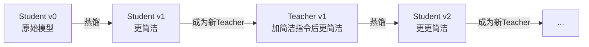

# 推理模型的悖论：少想反而更准——OPSDC 自蒸馏推理压缩

> 论文：[On-Policy Self-Distillation for Reasoning Compression](https://arxiv.org/abs/2603.05433)
>
> 作者：Hejian Sang, Yuanda Xu, Zhengze Zhou, Ran He, Zhipeng Wang, Jiachen Sun
>
> 推理模型产生的大量 CoT token 不仅冗余，而且有害——每个多余的 token 都在积累复合错误。OPSDC 用自蒸馏让模型学会简洁推理，压缩 57% 的同时准确率提升 16 个百分点。

---

## 一、这篇论文在解决什么问题

### 1.1 背景

现代推理模型（o1、Gemini 2.5、DeepSeek-R1、Qwen3）在回答之前会生成数千个 token 的内部思考。这种"出声思考"在难题上确实有效，但有一个尴尬的问题：它们**不知道什么时候该停下来**。问它 2+2 等于几，它可能花 500 个 token 考虑你是不是在问二进制运算。

已有的压缩方法都需要某种牺牲：
- **RL 方法**（长度惩罚）：需要 ground-truth 答案，且容易导致 entropy 崩塌
- **SFT 方法**（在短推理链上训练）：分布偏移，模型忘记自己的推理风格
- **Prompt 方法**（"请简洁"）：效果有限，换个 prompt 就失效

### 1.2 核心问题

能否在**不需要任何外部监督信号**的情况下，让推理模型学会自适应地压缩推理链——简单问题大幅压缩，难题保持深思？

---

## 二、方法：怎么解决的

### 2.1 核心 Insight

**模型已经知道怎么简洁，它只是需要"许可"。**

给 Qwen3-14B 加一条 "请简洁回答" 的指令，它就能在 MATH-500 上把推理链缩短 37% 同时提升准确率（70.0% → 83.8%）。OPSDC 做的事情就是：**把这个"加了简洁指令"的行为蒸馏回不加指令的模型里**。

这个想法简单到不可思议，但它有深刻的理论支撑。

### 2.2 技术细节

**Teacher 和 Student 是同一个模型**，区别仅在于输入：

- **Teacher**：$\pi_\theta(\cdot | x, c)$ — 加了简洁指令 $c$ 的模型
- **Student**：$\pi_\theta(\cdot | x)$ — 原始模型

训练目标是最小化 Student 自己生成的 rollout 上的 per-token reverse KL：

$$\mathcal{L}(\theta) = \mathbb{E}_{x \sim \mathcal{D}, y \sim \pi_\theta(\cdot|x)} \left[ \sum_{t=1}^{|y|} D_\text{KL}\left(\pi_\theta(\cdot|x, y_{<t}) \| \pi_{\bar\theta}(\cdot|x, c, y_{<t})\right) \right]$$

**为什么是 reverse KL 而不是 forward KL？** 这是最关键的设计选择：

- **Reverse KL**（mode-seeking）：Student 只在*自己正在生成*的 token 区域调整。这意味着 Teacher 更新时，Student 只需做小幅增量调整
- **Forward KL**：会被 Teacher 分布牵着走，每次 Teacher 更新都引起剧烈震荡。实验显示 Forward KL 在 AIME 上导致 23% 的准确率崩塌

**周期性 Teacher 更新**（每 $M=50$ 步同步一次权重）创造了级联压缩效应：

**自适应压缩的数学解释**：

对于简单题，Teacher 加了简洁指令后推理链大幅缩短 → KL 信号强 → 压缩力度大。
对于难题，Teacher 加了指令也无法大幅缩短（因为确实需要深思）→ KL 信号弱 → 压缩力度小。

论文将此形式化为命题 1：令 $\rho(x)$ 为"必要 token"比例（难度递增），压缩信号 $S(x) = D_\mathcal{C} - \rho(x)(D_\mathcal{C} - D_\mathcal{E})$ 是难度的递减函数。

### 2.3 方法对比

| 方法 | On-Policy | 无需GT | 难度自适应 | Entropy 保持 |
|------|:---------:|:------:|:----------:|:------------:|
| RL + 长度惩罚 | ✓ | ✗ | ✗ | ✗ |
| SFT 短推理链 | ✗ | ✗ | ✗ | ✓ |
| OPCD (Ye 2026) | ✓ | ✗ | ✗ | ✓ |
| Prompt/剪枝 | — | ✓ | ✗ | ✓ |
| **OPSDC** | **✓** | **✓** | **✓** | **✓** |

---

## 三、实验结果

### 3.1 实验设置

- **模型**：Qwen3-8B 和 Qwen3-14B
- **训练数据**：DAPO-Math-17k 的 ~13,600 道竞赛数学题（**只用题目，不用答案**）
- **硬件**：8× H200 GPU
- **训练量**：1 epoch，~100 步收敛（非常轻量）
- **评测**：MATH-500、AIME 2024、AIME 2025，两种 token budget（8K 和 30K）

### 3.2 主要结果（30K token budget）

| | MATH-500 Acc | MATH-500 压缩率 | AIME'24 Acc | AIME'24 压缩率 | MMLU |
|---|---|---|---|---|---|
| **Qwen3-8B Base** | 77.7% | — | 72.5% | — | 73.2 |
| Qwen3-8B + 简洁 prompt | 80.9% | 36.9% | 67.5% | 18.2% | — |
| **Qwen3-8B + OPSDC** | **86.6%** | **58.8%** | 69.6% | 35.4% | **73.3** |
| **Qwen3-14B Base** | 70.0% | — | 65.8% | — | 76.9 |
| Qwen3-14B + 简洁 prompt | 83.8% | 37.3% | 68.3% | 23.2% | — |
| **Qwen3-14B + OPSDC** | **86.1%** | **56.5%** | **76.3%** | **41.0%** | **76.9** |

几个关键数字的解读：

- **86.1% vs 70.0%**（Qwen3-14B MATH-500）：+16.1 个百分点，同时推理链缩短 56.5%。这不是 trade-off，是双赢
- **MMLU 完全保持**（73.2→73.3, 76.9→76.9）：自蒸馏没有损害通用能力，这是 on-policy 训练的优势
- **14B 比 8B 收益更大**：14B 起点更低但终点相当（86.1% vs 86.6%），说明大模型有更多冗余可以消除
- **AIME 2024 14B 提升 10.4 分**（65.8→76.3）：在最难的竞赛题上依然有效

### 3.3 消融实验

**为什么压缩能提升准确率？** 论文给出了定量解释：

设推理链长度 $L \approx 4660$ token，每个 token 独立出错概率 $p_{err} = 10^{-4}$，压缩率 $\alpha = 0.41$。准确率提升的下界为：

$$\frac{(1-p_{err})^{\alpha L}}{(1-p_{err})^L} \geq 1 + (1-\alpha)L \cdot p_{err} \approx 1.28$$

即理论上至少 28% 的相对提升。实际提升更大，因为推理错误之间是正相关的（一步错会导致后续步骤在错误基础上继续）。

**Entropy 稳定性**：训练过程中模型的 per-token entropy 完全稳定——与 RL 长度惩罚的 entropy 崩塌形成鲜明对比。

**Teacher 更新频率**：$M=50$ 步效果最优。太频繁（$M=10$）导致不稳定，太慢（$M=200$）压缩不够。

---

## 四、复现与落地评估

### 4.1 复现难度评估

| 维度 | 评级 | 说明 |
|------|------|------|
| 代码开源 | ⚠️ | 论文未提供代码链接，但方法极简，标准 SFT 框架即可实现 |
| 数据可得性 | ✅ | DAPO-Math-17k 公开，且不需要答案 |
| 算力需求 | 中 | 8× H200，~100 步收敛，训练成本很低 |
| 依赖复杂度 | 低 | 标准 PyTorch + HuggingFace，无需 RL 基础设施 |
| 复现总评 | ⭐⭐⭐⭐ | 方法简单到几乎可以直接从论文复现 |

### 4.2 工业落地可行性

- **适用场景**：任何需要降低推理成本的推理模型部署（数学推理、代码生成、逻辑推理）
- **性能开销**：训练后推理延迟降低 ~57%，无额外推理开销
- **集成难度**：只是一次微调，生成的模型与原始模型完全兼容
- **风险点**：在非数学任务上的效果待验证
- **落地总评**：⭐⭐⭐⭐⭐（如果在推理模型赛道，这几乎是必做的优化）

---

## 五、SOTA 对照矩阵

| 方法 | 核心思路 | MATH-500 Acc | 压缩率 | 需要GT | 训练成本 |
|------|---------|:---:|:---:|:---:|:---:|
| **OPSDC** | 自蒸馏 + reverse KL | **86.6%** | **58.8%** | ❌ | 低 |
| L1 (Aggarwal 2025) | RL + token cap | ~80% | ~40% | ✅ | 高 |
| SEER (Huang 2025) | SFT 最短正确解 | ~82% | ~45% | ✅ | 中 |
| OPCD (Ye 2026) | On-policy + 系统 prompt 蒸馏 | ~78% | ~35% | ✅ | 中 |
| Chain of Draft | Prompt trick | ~75% | ~30% | ❌ | 零 |

**OPSDC 是目前唯一不需要 ground-truth 同时实现最高压缩率和最高准确率的方法。** 这是范式级别的改进，不是增量。

---

## 六、讨论与局限

### 6.1 论文自身讨论的局限

- 仅在数学推理基准上验证
- AIME 2025（8B）准确率有轻微下降
- 未测试非英语场景

### 6.2 我的额外观察

1. **为什么 14B 基线准确率反而低于 8B？** 论文提到 Qwen3-14B 在 MATH-500 上基线 70.0% vs 8B 的 77.7%，但没有解释为什么。可能是 Qwen3-14B 的推理模式过度发散（更长的推理链 = 更多复合错误），恰好证明了论文的核心论点
2. **方法能否推广到代码推理？** 代码推理中的 "思考" token 结构与数学不同（更多的计划和回溯），压缩的安全边界可能不同
3. **与 Inference-time Scaling 的矛盾**：整个"给推理模型更多 token budget"的叙事被这篇论文挑战了——也许我们应该关注 token 质量而非数量
4. **training data 的选择**：只用 DAPO-Math-17k 的题目就够了，这暗示 OPSDC 本质上是在修正模型的推理风格而非注入新知识

---

## 七、对我们的启示

1. **谁应该关注？** 所有部署推理模型的工程师和研究者——这是几乎免费的性能提升
2. **核心 takeaway**：
   - 推理模型的大量 token 是有害的，不是有益的
   - 自蒸馏（concise prompt → reverse KL）是目前最优的推理压缩范式
   - 不需要 GT、不需要 reward model、不需要 difficulty estimator——简洁就是力量
   - Entropy 保持是关键——RL 长度惩罚为什么失败就是因为 entropy 崩塌
3. **实践建议**：
   - 立即在你的推理模型 pipeline 中尝试 OPSDC
   - 第一步先试"简洁 prompt"baseline，看看你的模型有多少冗余
   - 如果在做推理 API 服务，OPSDC 可以将成本降低一半以上

---

## 论文速查卡

| 项目 | 内容 |
|------|------|
| **标题** | On-Policy Self-Distillation for Reasoning Compression |
| **作者** | Hejian Sang, Yuanda Xu, Zhengze Zhou 等, 多所美国高校 |
| **链接** | [arXiv:2603.05433](https://arxiv.org/abs/2603.05433) |
| **发表** | 预印本 (2026.03.05) |
| **一句话总结** | 用模型自身的简洁版本做 teacher，通过 reverse KL 自蒸馏，在无需任何外部监督的情况下将推理链压缩 57% 同时提升准确率 16 个百分点 |
| **大白话版** | 就像一个啰嗦的学生被老师要求"说重点"，结果发现说重点之后不仅更快，答案还更准了——因为废话太多反而把自己绕晕了 |
| **核心数字** | MATH-500: 70.0% → 86.1%（+16.1），token 压缩 56.5% |
| **复现评级** | ⭐⭐⭐⭐ |
| **落地评级** | ⭐⭐⭐⭐⭐ |

---

## Part B：核心逻辑链与根本价值提炼

### 核心四要素

| 要素 | 内容 |
|---|---|
| **根本问题** | 推理模型的 CoT token 并非越多越好——冗余 token 通过复合错误效应主动损害准确率，但现有压缩方法都需要外部监督信号（GT 答案/奖励模型），限制了适用范围 |
| **切入视角** | 模型加上"请简洁"指令后已经能产生更好的推理（准确率提升 + token 减少），这意味着压缩知识已经在模型内部——只需要把它蒸馏出来 |
| **关键方法** | On-policy reverse KL 自蒸馏：Student 在自己的 rollout 上，学习匹配加了简洁指令的 Teacher 的 token 分布，周期性更新 Teacher 实现级联压缩 |
| **核心发现** | Qwen3-14B 在 MATH-500 上从 70.0% 提升至 86.1%，推理链缩短 56.5%，MMLU 完全保持——少想不仅不影响准确率，反而大幅提升 |

### 方法公式化

**简洁推理 = On-policy 自蒸馏(同一模型 + 简洁指令作 Teacher) × Reverse KL(mode-seeking 防 entropy 崩塌) × 周期性 Teacher 刷新(级联压缩)**

### 最终双重总结

**一句话总结（核心价值）**：OPSDC 通过将推理模型自身的简洁模式（conciseness-conditioned）用 reverse KL 蒸馏回无条件模式，在完全不需要外部监督的情况下实现了推理链 57% 压缩 + 16 个百分点准确率提升，揭示并解决了推理模型中冗余 token 导致复合错误的根本问题。

**一句话总结（大白话版）**：就像考试时，啰啰嗦嗦写满整张草稿纸的同学反而容易算错——因为写得太多把自己绕晕了。OPSDC 教会了模型"只写重点"，结果不仅写得快了一半，答案还更准了。
