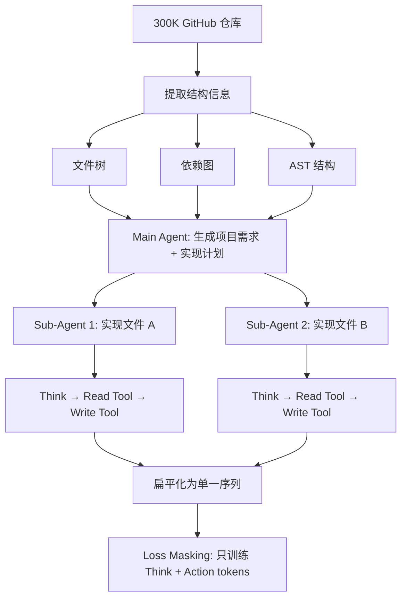

# 理解即重建：反向重建软件开发过程，让 LLM 从代码中学到真正的推理

> 论文：[Understanding by Reconstruction: Reversing the Software Development Process for LLM Pretraining](https://arxiv.org/abs/2603.11103)
>
> 作者：Zhiyuan Zeng, Yichi Zhang, Yong Shan, Kai Hua 等 14 人（ByteDance Seed, 复旦大学, M-A-P, HKUST）
>
> 代码仓库不是答案本身——它是一段被压缩掉了所有"为什么"和"试了什么失败了"的终态产物。把这些缺失的开发过程重建出来，能让 LLM 学到远比原始代码丰富的推理信号。

---

## 一、这篇论文在解决什么问题

### 1.1 背景

LLM 在代码生成方面的成功有目共睹，但在需要**深度、长时间跨度推理**的复杂软件工程任务上表现仍然不佳。现有的预训练数据——静态代码仓库——只是开发过程的终态。它们把人类开发者经历的需求分析、架构规划、试错调试、迭代重构全部抽象掉了。

用 Feynman 的话说："What I cannot create, I do not understand." 现有的预训练范式要求模型通过预测下一个 token 来"理解"代码，但代码仓库是高度压缩的——就像给你一张照片让你理解这栋建筑是怎么建起来的。模型学到的是表面的结构模式，而不是生成代码所需的因果推理。

### 1.2 核心问题

**如何让 LLM 从代码仓库中学到"为什么这样写"和"怎么一步步写出来的"，而不仅仅是"最终代码长什么样"？**

具体来说，论文要回答两个子问题：
1. 能否从静态代码仓库中**反向重建**出开发者可能经历的 agentic trajectory（规划→编码→调试→迭代）？
2. 用这些重建的轨迹做持续预训练，是否比直接用原始代码效果更好？

---

## 二、方法：怎么解决的

### 2.1 核心 Insight

**静态代码仓库是一个"答案"，但缺失了通往答案的"推理过程"。** 如果能把这个推理过程恢复出来——包括规划、试错、上下文查阅、迭代修正——就能为 LLM 提供远比原始代码丰富的训练信号。

关键类比：就像数学教育中，看到 $x = 5$ 远不如看到解方程的完整推导过程有价值。代码也一样——看到 `main.py` 导入了 `operations.py` 的 `add` 函数，远不如看到开发者**先读了 `operations.py` 确认了函数签名，再决定怎么写 `main.py`** 有价值。

### 2.2 技术细节

整个框架分两个阶段：

#### 阶段一：多智能体轨迹重建（Multi-Agent Trajectory Curation）

**Main Agent** 负责高层规划：给定整个代码仓库作为上下文，生成项目需求描述和文件创建顺序（依赖感知的执行计划）。

**Sub-Agent** 负责单文件实现，模拟开发者的三步循环：
1. **Think**：规划当前文件的结构和逻辑
2. **Read Tool**：读取其他已实现文件的内容（获取上下文）
3. **Write Tool**：生成代码

**关键的保真度设计**：为防止 LLM 模拟的轨迹偏离现实，论文从源仓库中提取三类结构信息作为约束：

| 结构信息 | 用途 | 注入方式 |
|---------|------|---------|
| 文件树 | 指导 Main Agent 的实现计划 | 作为 prompt 上下文 |
| 依赖图（import 分析） | 确定文件创建顺序 | 约束 Sub-Agent 的 Read Tool 调用 |
| AST 结构（类/函数定义） | 指导 Sub-Agent 的代码规划 | 作为 prompt 上下文 |

更重要的是，**Read Tool 的返回值被替换为真实文件内容，Write Tool 的输出被替换为真实代码**。这确保了轨迹的终态是真实的代码仓库，只有推理过程是合成的。

**数据格式化**：
- 层级结构被**扁平化**为单一序列（Main Agent 调用 Sub-Agent 时，递归注入 Sub-Agent 的完整轨迹）
- **Loss Masking**：只对 Think 和 Action tokens 计算损失，Observation（工具响应）被 mask 掉——强制模型学习因果推理而非记忆反馈

#### 阶段二：CoT 搜索优化（LongCoT Optimization）

阶段一生成的推理可能不够好。论文进一步优化每个 CoT 步骤 $z_i$，目标是找到使真实代码 $x$ 的条件概率最大化的推理路径：

$$z^* = \arg\max_z \log p(x | z)$$

具体操作：
1. **Sample**：对每个 CoT 步骤 $z_i$，用 LLM 生成 $k=2$ 个替代版本
2. **Evaluate**：将替代版本代入完整轨迹，计算真实代码 $x$ 的困惑度（Perplexity）
3. **Update**：如果新版本的 PPL 更低（即更好地预测了真实代码），则替换原版本

这个过程迭代 3 轮。直觉上：**好的推理应该让后续的代码"自然而然"地出现**——如果一段推理让模型生成正确代码变得更"惊讶"（高 PPL），说明这段推理有问题。

### 2.3 方法对比

| 维度 | 传统代码预训练 | SWE-Synth（Bug Fix 合成） | Understanding by Reconstruction |
|------|-------------|------------------------|-------------------------------|
| 数据粒度 | 文件/仓库级 | Bug-Fix 对级 | 完整开发轨迹级 |
| 包含推理过程 | ❌ | 部分（修复推理） | ✅（规划→查阅→编码→迭代） |
| 多文件依赖建模 | 隐式 | 有限 | ✅（依赖图驱动） |
| 训练目标 | 所有 token | 所有 token | 仅 Think + Action（mask Observation） |
| 保真度保证 | N/A | 真实 Bug | 真实代码 + 结构约束 |

---

## 三、实验结果

### 3.1 实验设置

- **基座模型**：Llama-3-8B-Instruct
- **训练数据**：300K GitHub 仓库 → 4B tokens 合成轨迹（Qwen3-30B-A3B 生成）
- **训练配置**：20B tokens，64K 上下文窗口
- **数据混合**：70% 通用域 + 30% 代码域（其中 18% 固定 Prolong Repos，12% 实验数据）
- **对比基线**：Raw-Repos（原始代码）、Prolong（外部基线）

### 3.2 主要结果

#### 长上下文理解

| Benchmark | 上下文长度 | Prolong | Raw-Repos | Repo2Agent | Repo2Agent-Search |
|-----------|-----------|---------|-----------|------------|-------------------|
| Ruler | 16K | 83.61 | 86.90 | 87.50 | **87.10** |
| Ruler | 64K | 57.10 | 61.00 | 58.10 | **61.80** |
| Helmet | 32K | 61.57 | 60.98 | 62.03 | **62.65** |

**解读**：在 64K 长上下文场景下，Repo2Agent-Search 以 **61.80** 显著超越 Prolong 的 57.10（+4.7 分）和 Raw-Repos 的 61.00（+0.8 分）。原因很直觉——开发轨迹天然包含长距离因果依赖（先读文件 A，才能写文件 B），这种结构化的长上下文信号比平铺的代码更有效。

#### 代码生成

| Benchmark | Prolong | Raw-Repos | Repo2Agent | Repo2Agent-Search |
|-----------|---------|-----------|------------|-------------------|
| HumanEval | 16.46 | 34.76 | 36.59 | **37.20** |
| LongCodeBench-32K | 29.38 | 34.16 | 34.51 | **36.46** |
| MATH | 1.64 | 2.18 | 3.72 | **3.76** |

**解读**：HumanEval 上 Repo2Agent-Search 达到 **37.20**，比 Raw-Repos 的 34.76 高 **2.44 分**（相对提升 7%）。LongCodeBench-32K 上差距更大：**36.46 vs 34.16**（+2.3 分）。这证明学习"创建代码的过程"比记忆"最终代码"更有效。

#### Agent 能力（APTBench）

| 类别 | Raw-Repos | Repo2Agent | Repo2Agent-Search |
|------|-----------|------------|-------------------|
| DeepResearch | 29.21 | **30.49** | 30.02 |
| Env-Setup | 20.61 | 21.01 | **21.61** |
| Issue-Fix | 33.72 | **34.84** | 33.80 |
| 总体 | 29.02 | **30.10** | 29.65 |

**解读**：Repo2Agent（未优化版）在 APTBench 上全面领先。特别有趣的是 CoT 优化版（Repo2Agent-Search）在 DeepResearch 的 Openend-Quality 子任务上达到 **26.20**（Raw-Repos: 21.99），说明搜索优化的推理提升了生成质量。但 Repo2Agent-Search 在 Issue-Fix 上略低于未优化版——可能因为 CoT 优化过度平滑了"试错"信号。

### 3.3 消融实验

从主实验可以提取几个关键消融：

1. **Raw-Repos → Repo2Agent**：加入轨迹结构后，几乎所有指标提升 → 轨迹本身就有价值
2. **Repo2Agent → Repo2Agent-Search**：CoT 优化在代码和长上下文任务上进一步提升，但在 Agent 任务上效果不稳定 → 搜索优化可能过于追求"干净"推理，丢失了试错信号
3. **Prolong vs Raw-Repos**：即使只是简单的代码替换（Raw-Repos），也能大幅超越 Prolong 在代码任务上的表现（HumanEval: 34.76 vs 16.46）→ 代码域数据的多样性本身就很重要

---

## 四、复现与落地评估

### 4.1 复现难度评估

| 维度 | 评级 | 说明 |
|------|------|------|
| 代码开源 | ❌ | 截至发表日期无代码仓库 |
| 数据可得性 | ⚠️ | 种子仓库来自 GitHub（可获取），但合成轨迹未公开 |
| 算力需求 | 高 | 300K 仓库 × Qwen3-30B 生成 4B tokens + 3 轮搜索优化 |
| 依赖复杂度 | 中 | 需要 AST 解析、依赖图提取、强 LLM 做轨迹合成 |
| 复现总评 | ⭐⭐☆☆☆ | 框架清晰但工程量大，且依赖强模型做合成 |

### 4.2 工业落地可行性

- **适用场景**：Coding Agent 和通用 LLM 的预训练数据增强
- **性能开销**：一次性合成成本高（300K repos × 多轮推理），但训练完成后无额外推理开销
- **集成难度**：可以直接作为持续预训练数据混入现有管线——只需要数据，不改模型架构
- **风险点**：
  - 合成质量依赖于强模型（Qwen3-30B），弱模型合成可能引入更多噪声
  - 300K 仓库的覆盖范围有限——Python 为主，其他语言未验证
  - CoT 搜索优化的计算成本随仓库复杂度线性增长
- **落地总评**：⭐⭐⭐☆☆（数据工程路径清晰，但上游合成成本高）

---

## 五、SOTA 对照矩阵

| 方法 | 核心思路 | 数据粒度 | 代码能力提升 | 推理迁移 | 长上下文 |
|------|---------|---------|------------|---------|---------|
| **Repo2Agent-Search（本文）** | 反向重建开发轨迹 | 仓库级 | HumanEval +2.44 | MATH +1.58 | Ruler-64K +4.7 |
| Quiet-STaR | 隐式推理 token | Token 级 | 未测 | 有提升 | 未测 |
| BOLT | EM 框架学习隐式推理 | 文档级 | 未测 | 有提升 | 未测 |
| TPT（Thinking Pre-training） | 前缀合成推理链 | 文档级 | 部分 | 有提升 | 未测 |
| REER | 困惑度驱动路径搜索 | 回答级 | 未测 | 有提升 | 未测 |
| SWE-Synth | Bug Fix 合成 | PR 级 | SWE-Bench 提升 | 未测 | 未测 |

**本文在 SOTA 版图中的位置**：这是首个在**仓库级别**做轨迹重建的工作，也是首个同时验证了代码、推理、长上下文、Agent 能力全线提升的合成数据方法。不是增量改进，而是一个新范式——从"合成更好的代码"到"合成写代码的过程"。

---

## 六、讨论与局限

### 6.1 论文自身讨论的局限

- 合成轨迹不可避免地包含 LLM 的噪声和偏差，因此选择持续预训练（而非 SFT）来增强对噪声的鲁棒性
- 仅在 Llama-3-8B 上验证，更大模型是否有同等收益未知

### 6.2 我的额外观察

1. **CoT 优化在 Agent 任务上效果不稳定**：Repo2Agent 在 APTBench 上总体优于 Repo2Agent-Search（30.10 vs 29.65）。这暗示搜索优化可能过度"美化"了推理路径——真实开发中的试错和回退本身就是有价值的训练信号。过于"正确"的推理反而可能丢失这些信号。

2. **12% 的数据比例是否最优？** 实验固定了 12% 实验数据比例，但没有探索更高比例是否带来进一步收益或收益递减。考虑到合成数据的噪声，可能存在一个最优混合比。

3. **语言覆盖偏差**：300K 仓库以 Python 为主（从 GitHub 筛选），论文没有验证其他语言（Java、C++、Rust）是否同样受益。代码的结构化程度因语言而异——Python 的动态性可能使得 AST 依赖图分析不够精确。

4. **与 SWE-bench 的缺失对比**：论文用了 APTBench 评估 Agent 能力，但没有在 SWE-bench 上做端到端评测。这是一个明显的缺失——如果声称提升了软件工程能力，SWE-bench 是绕不过去的 benchmark。

5. **Scaling 分析缺失**：只在 8B 模型上验证。对于大模型预训练社区来说，更关键的问题是：70B 模型是否也能从重建轨迹中获益？随着模型能力增强，对"过程"数据的需求是增加还是减少？

---

## 七、对我们的启示

**谁应该关注这篇论文？**
- 做 Code LLM 预训练的团队：这是当前最有创意的合成数据方案之一
- 做 Agent 数据合成的研究者：多智能体轨迹重建框架可以借鉴
- 关注 LLM 能力 scaling 的从业者：这提供了一条从"更多数据"到"更好数据"的路径

**核心 takeaway：**

1. **过程比结果更有训练价值**：将代码仓库的"终态"还原为"过程"，能全面提升模型能力——不仅是代码，还包括推理和长上下文理解
2. **Loss Masking 是关键设计决策**：只训练 Think + Action、mask 掉 Observation，强制模型学习因果推理而非记忆
3. **保真度约束不可或缺**：用真实的依赖图和文件内容约束合成过程，是防止轨迹漂移的关键
4. **CoT 优化是双刃剑**：搜索优化对代码/推理有效，但可能丢失 Agent 任务需要的"试错"信号
5. **合成数据的价值在于结构，不在于规模**：4B tokens 的结构化轨迹效果优于等量的原始代码

**实践建议：**
- 如果你有代码仓库和一个强 LLM，可以从小规模（1K 仓库）试起合成开发轨迹
- 关注 Loss Masking 策略——mask 掉工具响应的设计值得在其他 Agent 数据合成中复用
- 等代码开源后，优先试验 CoT 搜索优化在你的领域是否有效

---

## 论文速查卡

| 项目 | 内容 |
|------|------|
| **标题** | Understanding by Reconstruction: Reversing the Software Development Process for LLM Pretraining |
| **作者** | Zhiyuan Zeng, Yichi Zhang 等，ByteDance Seed / 复旦大学 / M-A-P |
| **链接** | [arXiv:2603.11103](https://arxiv.org/abs/2603.11103) |
| **发表** | arXiv 预印本，2026-03-11 |
| **一句话总结** | 将静态代码仓库反向重建为包含规划-调试-迭代的 agentic trajectory，用多智能体模拟 + CoT 搜索优化合成训练数据，在 Llama-3-8B 上全面提升长上下文、代码、推理和 Agent 能力 |
| **大白话版** | 就像学做菜——只看成品菜谱（最终代码）学不会，但如果有人录下了做菜全过程（买菜→切菜→尝味道→调整→出锅），你就能学到真正的厨艺 |
| **核心数字** | HumanEval +2.44（37.20 vs 34.76），Ruler-64K +4.7（61.80 vs 57.10），APTBench 总体 +1.08 |
| **复现评级** | ⭐⭐☆☆☆ |
| **落地评级** | ⭐⭐⭐☆☆ |

---

## 核心四要素（Part B）

| 要素 | 内容 |
|---|---|
| **根本问题** | LLM 从静态代码仓库中只能学到"结果长什么样"，学不到"怎么一步步推理出来的"——预训练数据缺失了人类开发过程中最有价值的规划、试错和迭代信号 |
| **切入视角** | 代码仓库是开发过程的高度压缩终态；反向重建这个过程——而不是生成更多代码——才是提升训练信号密度的正确方向 |
| **关键方法** | 多智能体模拟重建开发轨迹（Main Agent 规划 + Sub-Agent 实现），用仓库结构（依赖图 + AST）约束保真度，CoT 搜索优化确保推理质量（最小化代码困惑度） |
| **核心发现** | 12% 的轨迹数据替换原始代码后，Llama-3-8B 在代码（+2.44）、长上下文（+4.7）、Agent（+1.08）上全线提升，且 Loss Masking Observation 是关键设计 |

## 方法公式化

**理解 = 重建过程 × 结构约束 + 搜索优化**

即：高质量代码训练数据 = (多智能体模拟的开发轨迹 × 真实仓库结构约束) + 困惑度驱动的 CoT 搜索优化

## 最终双重总结

**一句话总结（核心价值）**：通过多智能体模拟将静态代码仓库反向重建为包含规划-查阅-编码-迭代的 agentic trajectory，并以困惑度最小化为目标搜索优化推理链质量，论文证明了"学习创建代码的过程"比"学习最终代码"能为 LLM 提供更丰富的训练信号——在仅替换 12% 预训练数据的条件下全面提升了长上下文理解、代码生成、推理和 Agent 能力。

**一句话总结（大白话版）**：就像学做菜——只看菜谱上的成品照片学不会做菜，但如果有人把做菜全过程（买菜、切菜、尝味道、调味、再尝）都录下来给你看，你就能学到真正的厨艺。这篇论文就是在给代码仓库"录做菜视频"。
