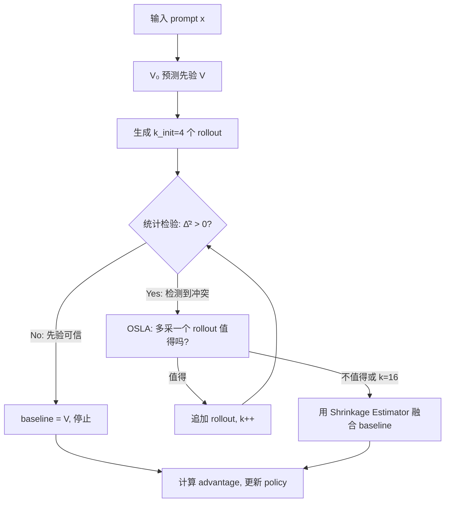

# V₀.₅：用预训练 Value Model 先验 + 统计检验解决 RLVR 稀疏 Rollout 的方差爆炸

> 论文：[Generalist Value Model as a Prior for Sparse RL Rollouts](https://arxiv.org/abs/2603.10848)
>
> 作者：Yi-Kai Zhang, Yueqing Sun, Hongyan Hao, Qi Gu, Xunliang Cai, De-Chuan Zhan, Han-Jia Ye 等（南京大学 + 美团）
>
> 在 RLVR 训练中，当 rollout 数量极少时（group size = 4），通过自适应融合预训练 Value Model 先验与经验均值，并用实时统计检验动态分配计算预算，在六个数学推理 benchmark 上超过 GRPO/DAPO 10%+。

---

## 一、这篇论文在解决什么问题

### 1.1 背景

RLVR（Reinforcement Learning with Verifiable Rewards）已成为 LLM 后训练阶段增强复杂推理能力的标准范式。在 RLVR 中，policy gradient 的训练稳定性高度依赖于 **advantage baseline 的质量**——baseline 不准，梯度就会方差爆炸，训练就会崩。

目前两种主流 baseline 方案各有硬伤：

| 方案 | 代表 | 优势 | 痛点 |
|------|------|------|------|
| 参数化 Value Model | PPO | 低方差 | 需要同步训练 critic，计算/显存开销巨大 |
| 经验采样均值 | GRPO/DAPO | 无偏，无额外模型 | 方差 ∝ 1/G，稀疏 rollout 时方差爆炸 |

对于长 horizon 的推理任务，每个 rollout 的生成成本极高，实践中 group size 往往受限于 4-8。此时 GRPO 的经验均值方差巨大，梯度信号被噪声淹没。

### 1.2 核心问题

**如何在极稀疏的 rollout 条件下（group size = 4），构建一个低方差且不被先验偏差污染的 advantage baseline？**

具体来说，需要同时解决两个子问题：
1. 如何安全地利用预训练 Value Model 的先验来降低方差，同时防止其 hallucination 污染梯度？
2. 如何动态决定"该不该多采几个 rollout"以降低不确定性？

---

## 二、方法：怎么解决的

### 2.1 核心 Insight

**把 baseline estimation 看作一个贝叶斯估计问题**：预训练 Value Model（V₀）的预测是先验，稀疏 rollout 的经验均值是观测。用 shrinkage estimator 自适应融合两者，并通过实时统计检验判断先验是否可信——可信时大幅依赖先验降低方差，不可信时隔离先验并动态追加 rollout。

这个 insight 的优雅之处在于：它不假设先验总是对的（V₀ 可能在 OOD 问题上胡说），也不放弃先验的方差降低潜力。通过 **MSE 的正交分解**，它在数学上精确地找到了偏差和方差之间的最优平衡点。

### 2.2 技术细节

#### Shrinkage Estimator 融合

V₀.₅ 的 baseline 是经验均值 $\bar{v}_k$ 和先验预测 $V$ 的凸组合：

$$\hat{\mu}^* = \hat{w}_k \bar{v}_k + (1 - \hat{w}_k) V$$

关键在于权重 $\hat{w}_k$ 的计算。论文证明了 baseline 的 MSE 可以正交分解为：

$$\text{MSE}(\mu^*) = w^2 \cdot \sigma_{\text{noise}}^2 + (1-w)^2 \cdot \Delta^2$$

其中 $\sigma_{\text{noise}}^2 = 1/k$ 是经验均值的观测方差（reward ∈ {-1, 1} 时最大方差为 1），$\Delta^2 = (V - \mu_{\text{true}})^2$ 是先验偏差。

**对 $w$ 求导令 MSE 最小化**，得到最优权重：

$$w^* = \frac{\Delta^2}{\Delta^2 + \sigma_{\text{noise}}^2}$$

直觉理解：
- **先验偏差大**（$\Delta^2 \gg \sigma_{\text{noise}}^2$）→ $w^* \to 1$ → 完全信任经验均值
- **先验偏差小**（$\Delta^2 \ll \sigma_{\text{noise}}^2$）→ $w^* \to 0$ → 完全信任先验

举个数值例子：group size = 4 时 $\sigma_{\text{noise}}^2 = 0.25$。如果先验偏差 $\Delta^2 = 0.01$（先验很准），则 $w^* = 0.01/0.26 \approx 0.04$——96% 的权重给先验，方差从 0.25 骤降到接近 0。

#### 实时统计检验

问题是 $\Delta^2$ 未知。论文用经验估计：

$$\hat{\Delta}_k^2 = \max\left(0, (\bar{v}_k - V)^2 - \frac{1}{k}\right)$$

这个 $\max(0, \cdot)$ 操作等价于一个假设检验：**零假设 "先验是准确的（$\Delta = 0$）"，只有当经验均值与先验的偏差显著超过采样噪声上界 $1/k$ 时，才拒绝零假设**。

这意味着：
- 如果 $(\bar{v}_k - V)^2 \leq 1/k$：先验可信，$\hat{\Delta}_k^2 = 0$，$\hat{w}_k = 0$，baseline 完全使用先验
- 如果 $(\bar{v}_k - V)^2 > 1/k$：检测到冲突，开始增加经验均值权重

#### Sequential OSLA 动态预算分配

静态融合解决了"如何混合"的问题，但在极稀疏条件下，统计检验可能因为采样噪声误判。V₀.₅ 进一步引入 One-Step-Look-Ahead（OSLA）序贯分析：

定义总风险为估计误差 + 计算成本：

$$R(k) = \widehat{\text{MSE}}(k) + c \cdot k$$

其中 $c = 0.0039$ 是每个 rollout 的边际成本。系统实时判断"多采一个 rollout 带来的 MSE 降低是否值得其计算成本"：
- **停止**：MSE 已经足够低，或追加采样的边际收益低于成本
- **继续**：先验偏差大，需要更多数据来纠正

实际运行中，每个 prompt 从 $k_{\text{init}} = 4$ 开始，最多扩展到 16。大多数情况下（先验准确时）在 4 就停止，仅在检测到先验 hallucination 时才追加。

### 2.3 方法对比

| 方法 | baseline | 需要额外模型 | 方差 | 偏差 | 动态预算 |
|------|----------|-------------|------|------|---------|
| PPO | 参数化 critic | ✅ 同步训练 | 低 | 可能偏 | ❌ |
| GRPO | 经验均值 | ❌ | 高（∝1/G）| 无偏 | ❌ |
| DAPO | 经验均值+过滤 | ❌ | 中 | 低偏 | ❌ |
| **V₀.₅** | Shrinkage 融合 | ⚠️ 冻结 V₀ | **极低** | 有界偏（≤1/√k）| ✅ |

---

## 三、实验结果

### 3.1 实验设置

- **Base model**：Qwen3-4B-Instruct-2507
- **训练数据**：DAPO-Math-17k
- **硬件**：4 nodes × 8 GPUs = 32 GPUs，sglang 引擎
- **评估**：6 个数学推理 benchmark（AIME 2024/2025、Olympiad Bench、MATH500、Minerva Math、AMC 2023），mean@16
- **对比基线**：GRPO（G=16）、DAPO（G=16）

### 3.2 主要结果

V₀.₅ 在**所有 6 个 benchmark** 上都超过 GRPO 和 DAPO：

| Benchmark | GRPO (G=16) | DAPO (G=16) | V₀.₅ (k_init=4) | 提升 |
|-----------|-------------|-------------|------------------|------|
| AIME 2024 | ~24% | ~25% | **~35%** | **+10pp** |
| AIME 2025 | ~16% | ~17% | **~24%** | **+8pp** |
| MATH500 | ~80% | ~81% | **~88%** | **+7pp** |
| AMC 2023 | ~58% | ~60% | **~68%** | **+8pp** |

（数值从论文 Figure 1 读取的近似值，实际为收敛后的平均精度）

**关键观察**：V₀.₅ 不仅最终精度更高，**收敛速度也更快**——大约在 GRPO 训练到一半时就已经达到 GRPO 的最终水平。

### 3.3 消融实验

#### 极端稀疏条件（不开 OSLA）

| Group Size | 方法 | 效果 |
|------------|------|------|
| G=16 | GRPO | 基线 |
| k=8 | V₀.₅（无 OSLA） | **优于 GRPO G=16** |
| k=4 | V₀.₅（无 OSLA） | **优于 GRPO G=16** |
| k=2 | V₀.₅（无 OSLA） | 训练不收敛 |
| k=1 | V₀.₅（无 OSLA） | 训练不收敛 |

**k=4 就能超过 G=16 的 GRPO**——这意味着 4x 的计算节省（或等价地，同等算力下 4x 的 prompt batch size 增大）。

k=1-2 失败的原因很有道理：在 binary reward {-1, 1} 空间中，k=2 时经验均值只有 {-1, 0, 1} 三个可能值，离散量化间隔太大，导致统计检验频繁误判先验为不可信，失去了先验的稳定作用。

#### 梯度范数与 Entropy 分析

- **梯度范数**：V₀.₅ 显著低于且稳定于 GRPO，验证了低方差 baseline 有效抑制了梯度爆炸
- **Policy Entropy**：V₀.₅ 维持更高的 entropy，说明低噪声梯度避免了过早收敛到局部最优

---

## 四、复现与落地评估

### 4.1 复现难度评估

| 维度 | 评级 | 说明 |
|------|------|------|
| 代码开源 | ⚠️ | 有项目页面 [now-join-us.github.io/V0_5](https://now-join-us.github.io/V0_5)，但完整代码暂未确认 |
| 数据可得性 | ✅ | DAPO-Math-17k 公开，V₀ 训练数据基于 Qwen3 系列公开模型生成 |
| 算力需求 | 高 | 32 GPUs 训练，V₀ 预训练需 128 GPUs × 40h |
| 依赖复杂度 | 中 | 需要 V₀ 模型（含 TabPFN-v2.5）+ sglang 引擎 + 标准 RL 训练 pipeline |
| 复现总评 | ⭐⭐⭐ | V₀ 模型本身的预训练是最大障碍，但如果 V₀ 权重开放则复现较容易 |

### 4.2 工业落地可行性

- **适用场景**：任何使用 GRPO/DAPO 做 RLVR 训练的团队，尤其是 rollout 成本高的长 horizon 推理任务
- **性能开销**：V₀ 推理调用有额外延迟，但远低于多生成 12 个 rollout 的成本（从 G=16 降到 k=4）
- **集成难度**：需要在 RL 训练 loop 中增加 V₀ 推理和 OSLA 逻辑，改动不大但需要工程适配
- **风险点**：V₀ 在新 domain（非数学推理）的泛化能力未知
- **落地总评**：⭐⭐⭐⭐（对 RLVR 团队来说 ROI 很高）

---

## 五、SOTA 对照矩阵

| 方法 | 核心思路 | Group Size 需求 | 数学推理精度 | 计算效率 | 需要 Value Model |
|------|---------|----------------|-------------|---------|-----------------|
| **V₀.₅** | Shrinkage 融合 + OSLA | **4（动态至 16）** | **最高（+10pp）** | **最高** | 冻结 V₀ |
| GRPO | 组内经验均值 | 16+ | 基线 | 中 | ❌ |
| DAPO | 经验均值 + 过滤/非对称裁剪 | 16+ | 略高于 GRPO | 中 | ❌ |
| PPO | 参数化 critic | N/A | 低于 GRPO | 低（同步 critic） | ✅ 同步训练 |
| MC-GRPO | 中位数 baseline + MAD | 16+ | 略高于 GRPO | 中 | ❌ |
| HA-DW | Kalman 滤波历史锚点 | 16+ | 高 | 中 | ❌ |

V₀.₅ 在 RLVR baseline estimation 这个方向上是**范式级的改进**——它不是在 GRPO 框架内调参，而是引入了一个全新的信息源（预训练 Value Model 先验）和一套严谨的统计融合机制。

---

## 六、讨论与局限

### 6.1 论文自身讨论的局限

- $\hat{w}_k$ 依赖随机变量 $\bar{v}_k$，使融合 baseline 有偏——但论文证明偏差严格有界于 $\mathcal{O}(1/\sqrt{k})$
- k=1-2 时离散量化导致统计检验失效

### 6.2 我的额外观察

1. **V₀ 的预训练覆盖度是瓶颈**：V₀ 用 Qwen3 系列（0.6B-30B）的 GRPO 训练轨迹构建，如果 policy model 是完全不同的架构（如 Llama），V₀ 的先验质量可能下降。论文没有测试跨架构的 V₀ 泛化。

2. **只验证了数学推理**：六个 benchmark 全是数学——代码生成、Agent 决策、开放域推理等场景的效果完全未知。数学推理的 reward 是 binary 的（对/错），其他场景可能有连续 reward，MSE 分解和统计检验的形式需要调整。

3. **V₀ 预训练成本不可忽视**：128 GPUs × 40h 的 V₀ 预训练是一次性成本，但对于小团队来说仍然显著。论文没有探讨用更轻量的 V₀ 替代方案（如 few-shot LLM prompting 作为 value prior）。

4. **OSLA 的 cost parameter $c$ 如何选取？** 论文固定 $c = 0.0039$（max budget = 16），但不同场景的最优 $c$ 可能差异很大。缺少灵敏度分析。

5. **与 OpenClaw-RL 的关系**：OpenClaw-RL 用对话反馈做在线 RL（OPD），V₀.₅ 用预训练 Value Model 做 baseline 优化——两者可能是互补的。在 OpenClaw-RL 框架中引入 V₀ 作为 advantage baseline 先验，是一个有趣的融合方向。

---

## 七、对我们的启示

1. **谁应该关注？** 任何在做 RLVR/GRPO/DAPO 训练的团队——这是直接可用的效率提升
2. **核心 takeaway**：
   - Shrinkage estimation 是融合先验与观测的数学最优框架
   - 统计检验提供了"自动信任调节"——不需要手动设定先验权重
   - Group size 4 即可稳定训练，意味着 4x 计算节省
   - MSE 的正交分解 → 偏差和方差可以独立控制
3. **实践建议**：
   - 如果你在用 GRPO 训练，先尝试降低 group size 到 8 并用一个简单的 value prior（哪怕是 few-shot LLM 预测）做 shrinkage fusion
   - 关注 V₀ 权重是否开放——如果开放，可以直接在你的 pipeline 中集成
   - 如果你在做非数学领域的 RLVR，需要自行验证 V₀ 先验的适用性

---

## 论文速查卡

| 项目 | 内容 |
|------|------|
| **标题** | Generalist Value Model as a Prior for Sparse RL Rollouts |
| **作者** | Yi-Kai Zhang 等, 南京大学 + 美团 |
| **链接** | [arXiv:2603.10848](https://arxiv.org/abs/2603.10848) |
| **发表** | arXiv 预印本, 2026.03 |
| **一句话总结** | 将预训练 Value Model 视为贝叶斯先验，通过 shrinkage estimator + 实时统计检验 + OSLA 动态预算分配，在 group size = 4 的极端稀疏条件下实现了超越 GRPO (G=16) 10%+ 的 RLVR 训练效果 |
| **大白话版** | 像找一个有经验的老师先估个分，然后只让学生做少量练习来验证老师估得准不准——估得准就直接用老师的分数，估得不准就让学生多做几道题 |
| **核心数字** | group size 4 超过 GRPO G=16 10%+；驱逐 MSE 数学证明有界 |
| **复现评级** | ⭐⭐⭐ |
| **落地评级** | ⭐⭐⭐⭐ |
